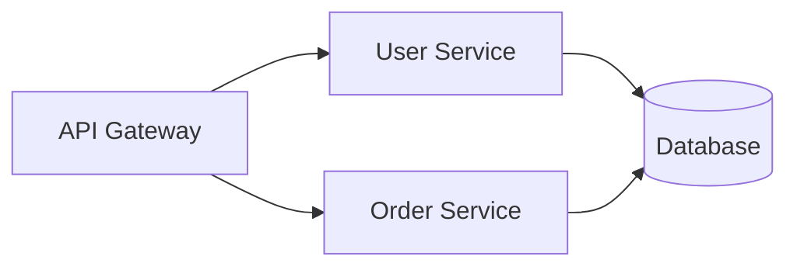

# 项目知识库系统设计（Knowledge-Lib）

> 日期：2026-03-29
> 状态：已批准

---

## 一、定位与目标

### 定位
混合模式知识库系统：
1. **个人/团队助手** — 辅助开发者理解项目、排查 bug、Code Review
2. **项目文档中枢** — 架构、设计决策的权威文档来源
3. **AI Agent 上下文** — 为 AI 代码生成和审核提供项目背景知识

### 目标用户
- 小团队（3-10人），有 Code Review 流程
- Java Spring Boot 项目，项目年龄 1-4 年

### 核心目标
1. 维护好项目架构设计，了解项目整体的设计和数据流向
2. 维护好项目的子服务、模块间的依赖关系，确保职责边界清晰
3. 维护好项目的依赖关系，做到下个需求来的时候，知道对上下游的兼容性、依赖关系

---

## 二、知识库内容

| 序号 | 知识库 | 内容 |
|------|--------|------|
| 01 | 架构知识库 | 系统架构图、模块关系图、数据流向图、模块依赖关系 |
| 02 | 子服务设计知识库 | 每个子服务的功能、职责、对外接口、内部模块结构 |
| 03 | 功能设计知识库 | 具体功能的设计文档、业务流程、功能规格 |
| 04 | 设计稿知识库 | Figma/原型链接 + 摘要（设计稿留在设计工具里） |
| 05 | Bug 知识库 | 问题现象、根因、修复方式、预防措施 |
| 06 | 决策知识库（ADR） | 设计决策背景、考虑过的方案、最终选择及原因 |
| 07 | 运维知识库 | 部署配置、环境变量、外部依赖 |
| 08 | 代码坏味道库 | 历史重构记录、坏味道说明、架构腐化案例 |

---

## 三、使用方式

| 方式 | 说明 |
|------|------|
| **A. 对话式查询** | 问 AI 问题："这个模块的依赖关系是什么"、"上次那个类似的 bug 是怎么修的" |
| **B. PR 自动触发** | Code Review 时自动弹出相关知识、AI 生成 PR 时自动补充上下文 |
| **D. 主动推送** | 基于代码变更，AI 自动推断并推送可能受影响的知识点 |

### 主动推送场景示例
- 改了一个配置类 → 推送相关设计决策、运维注意事项
- 新增跨服务调用 → 推送依赖关系检查结果
- 修改核心实体 → 推送被引用情况、历史相关 Bug
- **新增数据库表** → 推送依赖此表的查询/写入代码列表
- **修改配置项** → 推送哪些功能依赖此配置、历史变更记录

---

## 四、数据来源

| 来源 | 采集方式 |
|------|----------|
| Git 历史 | commit message、MR/PR 讨论、code review |
| AST 分析 | 代码结构、包关系、服务调用关系 |
| 代码注释 | Javadoc、注释提取 |

---

## 五、系统架构

```
┌─────────────────────────────────────────────────────────┐
│                    使用层（User Layer）                   │
├─────────────────────────────────────────────────────────┤
│  AI 对话查询    │  PR 自动触发    │  主动推送           │
└────────┬────────────────┬──────────────────┬────────────┘
         │                │                  │
         ▼                ▼                  ▼
┌─────────────────────────────────────────────────────────┐
│                  知识库层（Knowledge Layer）              │
├─────────────────────────────────────────────────────────┤
│  01 架构知识库                                        │
│  02 子服务设计知识库                                  │
│  03 功能设计知识库                                    │
│  04 设计稿知识库（Figma 链接）                       │
│  05 Bug 知识库                                       │
│  06 决策知识库（ADR）                                │
│  07 运维知识库                                       │
│  08 代码坏味道库                                     │
└─────────────────────────────────────────────────────────┘
         │
         ▼
┌─────────────────────────────────────────────────────────┐
│                    采集层（Collection Layer）            │
├─────────────────────────────────────────────────────────┤
│ Git Commit │  AST 分析  │  PR/MR 讨论  │  代码注释       │
└─────────────────────────────────────────────────────────┘
         │
         ▼
┌─────────────────────────────────────────────────────────┐
│                    存储层（Storage Layer）               │
├─────────────────────────────────────────────────────────┤
│  Markdown 文件（源文件）│  RAG 向量库（检索用）        │
└─────────────────────────────────────────────────────────┘
```

### 分层说明

**采集层** — 把各种来源的知识"采"进来：
- Git 历史：脚本解析 commit、PR 讨论
- 代码本身：AST 分析，提取类名、方法、依赖关系
- 是一次性的 + 增量更新的结合

**存储层** — 知识的存放方式：
- Markdown 文件：架构图、ADR、Bug 记录（人可读，Git 版本化）
- RAG 向量库：AI 语义检索用

---

## 六、知识库层级边界

### 三层知识库回答不同问题

| 层级 | 回答什么问题 | 模块的含义 |
|------|-------------|-----------|
| **架构知识库** | "项目整体长什么样" | 服务级别的模块（一个服务 = 一个模块） |
| **子服务设计** | "这个服务内部是怎么组织的" | 服务内部的包/业务模块（api、service、repository） |
| **功能设计** | "这个功能是怎么设计的" | 功能点、业务流程、业务规则 |

### 具体举例

**场景：用户注册功能**

| 层级 | 内容 |
|------|------|
| **架构知识库** | user-service 和 order-service 之间是什么关系？数据流向是怎样的？ |
| **子服务设计** | user-service 内部的模块：UserApi、UserService、UserRepository、UserEntity |
| **功能设计** | 用户注册的完整流程：输入校验 → 账号创建 → 积分初始化 → 发送欢迎消息 |

### 清晰边界的方法

**原则：只写自己层级的上下文，不重复下级细节**

| 层级 | 包含 | 不包含 |
|------|------|--------|
| **架构知识库** | 服务关系、部署结构、数据流向、顶层依赖图 | 服务的内部实现细节 |
| **子服务设计** | 服务的功能列表、对外接口、内部包结构、上下游依赖 | 具体的业务流程、每个接口的入参 |
| **功能设计** | 业务流程、业务规则、状态机、异常场景 | 服务内部怎么实现（那是子服务设计的事） |

### 互相引用，不重复

```
架构知识库
└── "user-service 详情，见 01-service-design/user-service"

子服务设计
└── "用户注册功能详情，见 02-function-design/user-register"
└── "依赖 order-service，详见 00-architecture/dependencies"

功能设计
└── "涉及 user-service 和 order-service"
```

---

## 七、知识库目录结构

```
knowledge-lib/
├── README.md                    # 知识库索引和使用指南
├── 00-architecture/             # 01 架构知识库
│   ├── 00-overview.md          # 系统架构图（Mermaid）
│   ├── 01-services/            # 子服务列表
│   │   ├── user-service.md
│   │   ├── order-service.md
│   │   └── payment-service.md
│   ├── 02-dependencies.md       # 模块依赖关系（Mermaid）
│   ├── 03-api-dependencies.md   # API 依赖关系
│   └── 04-data-flow.md          # 数据流向图（Mermaid）
├── 01-service-design/           # 02 子服务设计知识库
│   ├── user-service/
│   │   ├── overview.md         # 服务概述
│   │   ├── api.md              # 对外接口
│   │   ├── modules.md          # 内部模块结构
│   │   └── dependencies.md      # 上下游依赖
│   ├── order-service/
│   └── payment-service/
├── 02-function-design/          # 03 功能设计知识库
│   ├── 2024-Q1/
│   │   ├── user-login.md       # 功能设计文档
│   │   └── payment-callback.md
│   └── template.md
├── 03-designs/                  # 04 设计稿知识库
│   ├── 2024-Q1/
│   │   ├── user-module-v2.md   # Figma 链接 + 摘要
│   │   └── payment-flow.md
│   └── template.md
├── 04-bugs/                    # 05 Bug 知识库
│   ├── 2024/
│   │   ├── bug-001-xxx.md
│   │   └── bug-002-xxx.md
│   └── template.md
├── 05-decisions/               # 06 决策知识库（ADR）
│   ├── ADR-001-xxx.md
│   ├── ADR-002-xxx.md
│   └── template.md
├── 06-operations/              # 07 运维知识库
│   ├── deployment.md
│   ├── env-variables.md
│   └── external-dependencies.md
└── 07-anti-patterns/           # 08 代码坏味道库
    └── legacy-refactorings.md
```

---

## 八、Phase 规划

### Phase 1（1-2月）：架构守护
**优先级最高，堵住架构腐化的源头**

| 工具 | 作用 |
|------|------|
| AST 解析脚本 | 扫描项目结构，生成知识库初版 |
| GitHub PR Action | PR 时检查模块依赖是否违规 |
| 主动推送（简易版） | PR 评论时推送相关知识点 |

**PR 检查内容：**
- 跨层调用检测
- 循环依赖检测
- 依赖穿透检测（order-service 禁止直接调用 user-service 的 repository）
- 新增依赖白名单检查

### Phase 2（3-4月）：Bug 排查加速
- Bug 知识库积累（每次线上 Bug 修复后强制填写模板）
- AI 辅助排查（描述 Bug 现象 → 检索类似问题）
- GitHub Issue 联动

### Phase 3（5-6月）：新人上手 + 全面主动推送
- 基于知识库生成"项目概览"文档
- AI 问答式探索
- 全面主动推送覆盖更多场景

---

## 九、实现路径

**核心理念：买大于建 + 轻量流程**

| 工具 | 来源 |
|------|------|
| 架构检查 | GitHub PR Action（现有机器人如 arch-bot，或自研） |
| 知识采集 | AST 解析脚本（Maven 插件/Gradle Task） |
| 知识存储 | Markdown + Git |
| 语义检索 | GitHub Copilot Chat / 接入 RAG 服务 |
| 主动推送 | GitHub Action + 知识库脚本 |
| 设计稿 | 手动维护 Markdown + Figma 链接 |

### 推动方式
- **Bug 知识库和 ADR**：强制流程（Bug不复盘不让 close PR；重大设计变更必须写 ADR）
- **其他知识库**：自愿填写，PR 合入时提示
- 知识库贡献计入团队贡献统计

---

## 十、知识库运营

### 责任划分

| 角色 | 职责 |
|------|------|
| **架构 Owner** | 负责架构知识库、子服务设计知识库的质量和更新 |
| **开发者** | 负责功能设计知识库、Bug 知识库、代码坏味道库的填写 |
| **运维 Owner** | 负责运维知识库的维护 |

### 强制流程
- **Bug 知识库**：每次线上 Bug 必须填写复盘模板，否则不许 close PR
- **ADR**：重大技术决策（影响多个模块、引入新依赖、架构变更）必须填写 ADR

### 质量保障
- **准确性**：AI 检索结果标注来源，人工复核关键信息
- **时效性**：代码变更时，同步更新受影响的知识库条目
- **淘汰机制**：每季度 review 一次知识库，清理过期或重复内容

---

## 十一、架构图说明

架构图统一使用 **Mermaid 语法**，写在 Markdown 文件里，便于版本控制和渲染。

示例：


---

## 十二、关键原则

1. **知识跟着代码走** — 知识库存放在项目 `knowledge-lib/` 目录，不用额外的文档系统
2. **Mermaid 作图** — 架构图用 Mermaid 语法，维护成本低
3. **买大于建** — 优先用现有工具，不重复造轮子
4. **精准检索优先** — AI 能力以准确回答问题、引用来源为核心
5. **架构守护第一** — Phase 1 优先解决架构腐化问题
