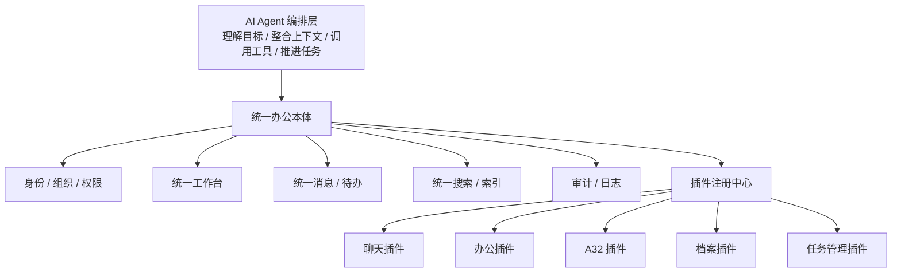
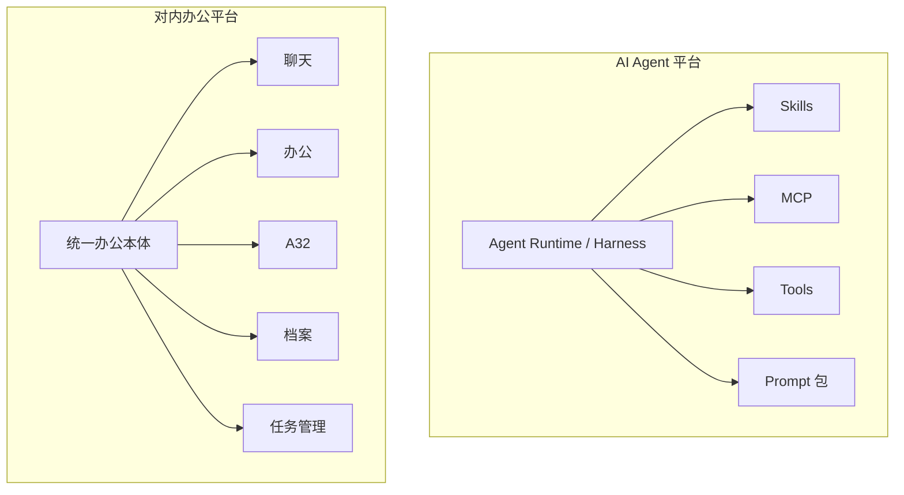
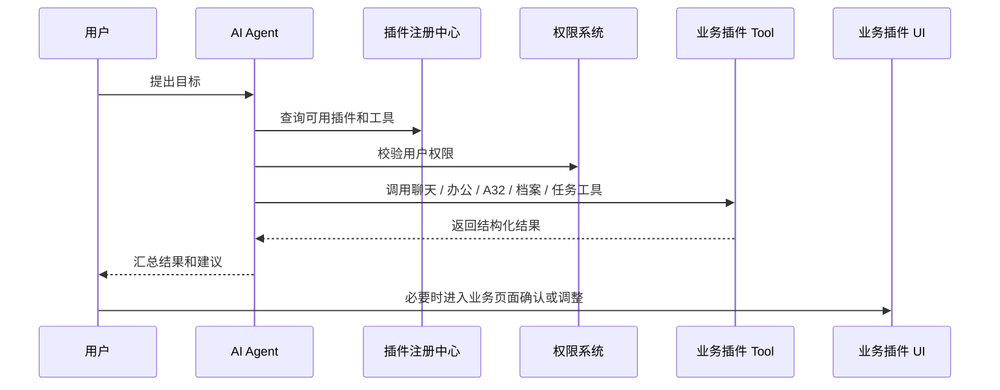
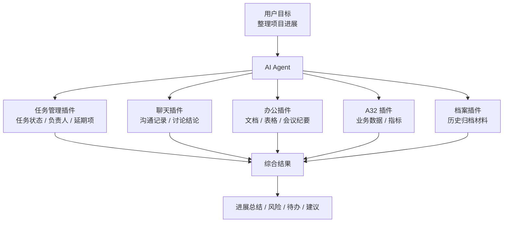
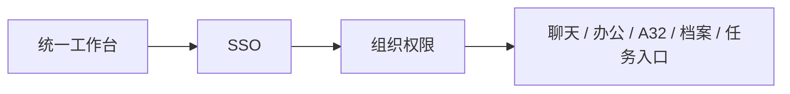

<!-- @format -->

# 从 AI 智能体看对内软件一体化

## 0. 核心判断

从 AI 智能体视角看，对内软件一体化不应只是把聊天、办公、A32、档案、任务管理等系统放到一个入口里。

更合理的方向是：

> 以统一办公本体为底座，把各类对内业务系统插件化，再由 AI Agent 作为上层编排者，统一理解上下文、调用工具、推进任务闭环。

可以抽象为：

```text
对内软件一体化 = 统一办公本体 + 业务插件体系 + AI Agent 编排层
```



这个方向的关键不是“把所有系统重做一遍”，而是把现有系统改造成可被统一接入、可被 Agent 调用、可被人继续使用的插件。

---

## 一、为什么不是简单的入口一体化

传统对内软件一体化，通常是入口聚合：

```text
一个门户
  ├─ 聊天
  ├─ 办公
  ├─ A32
  ├─ 档案
  └─ 任务管理
```

这种方式解决了“入口分散”的问题，但没有真正解决“工作割裂”的问题。

| 问题 | 入口一体化的局限 |
| --- | --- |
| 上下文割裂 | 聊天、文档、任务、档案之间缺少统一理解 |
| 流程割裂 | 用户仍然要手动在多个系统之间复制、查询、推进 |
| 数据难用 | 数据在系统里，但不能直接服务具体目标 |
| 任务不闭环 | 系统只记录信息，不主动推动下一步 |
| 复用困难 | 新系统接入时，仍然容易变成新的孤岛 |

AI Agent 带来的变化是：

```text
过去：
人找系统 -> 人查信息 -> 人整理结果 -> 人推动流程

现在：
人提出目标 -> Agent 找系统 -> Agent 整合信息 -> Agent 协助推进流程
```

所以，一体化的重点要从“统一入口”升级为“统一上下文、统一调用、统一编排”。

---

## 二、从 AI Agent 平台类比对内 OA 平台

AI 智能体平台中，MCP、Skills、Tools 本质上都是插件化能力。

同理，对内办公 OA 平台中，聊天、办公、A32、档案、任务管理等也可以被看作业务插件。

| 类型 | 本体 | 插件 / 模组体 |
| --- | --- | --- |
| AI Agent 平台 | Agent Runtime / Harness | MCP、Skills、Tools、Prompt、Memory |
| 对内办公 OA 平台 | 统一身份、权限、工作台、消息、搜索、审计 | 聊天、办公、A32、档案、任务管理、审批、知识库 |



这个类比的意义是：

- MCP / Skills 不是 Agent 的“内置功能”，而是可接入、可替换、可复用的能力。
- 聊天 / 办公 / A32 / 档案 / 任务管理，也不应全部塞进一个巨型 OA 本体。
- OA 本体应该负责统一规则和接入边界，业务系统作为插件独立演进。
- Agent 在上层负责跨插件理解、调用和编排。

---

## 三、目标架构：统一办公本体 + 业务插件 + Agent 编排

### 3.1 统一办公本体

统一办公本体不负责承载所有业务细节，只负责共性能力。

| 本体能力 | 作用 |
| --- | --- |
| 统一身份 | 所有插件使用同一套账号 |
| 组织权限 | 人、部门、岗位、角色、权限统一 |
| 统一工作台 | 插件统一入口和导航 |
| 统一消息 / 待办 | 通知、提醒、任务、审批入口统一 |
| 统一搜索 / 索引 | 跨聊天、文档、档案、任务检索 |
| 插件注册中心 | 管理插件声明、能力、权限、版本 |
| 审计日志 | 记录人和 Agent 的关键操作 |

```text
统一办公本体

┌──────────────────────────────────────────────┐
│ Core                                         │
│ 身份 / 组织 / 权限 / 工作台 / 消息 / 搜索 / 审计│
│                                              │
│   ○ UI 插槽      ○ 数据插槽      ○ Tool 插槽  │
└──────┼──────────────┼─────────────┼──────────┘
       │              │             │
   ┌───▼───┐      ┌───▼───┐     ┌───▼────┐
   │业务 UI │      │业务数据│     │Agent工具│
   └───────┘      └───────┘     └────────┘
```

### 3.2 业务插件

每个对内系统都可以先包装为业务插件，而不是一开始重构。

```text
业务插件 = UI 入口 + API 能力 + Agent Tool
```

注意：不是所有插件都必须有 UI。纯工具插件可以没有 UI；但聊天、办公、A32、档案、任务管理这类业务系统，通常应该保留 UI 入口。

原因是：

- 人需要兜底操作。
- Agent 结果需要可追溯。
- 写操作需要人工确认。
- 插件权限和配置需要管理入口。
- 员工仍然需要直接使用业务系统。

| 插件 | UI 入口 | API 能力 | Agent Tool |
| --- | --- | --- | --- |
| 聊天插件 | 会话、群聊、消息详情 | 查消息、发通知 | `search_messages`、`summarize_conversation`、`notify_user` |
| 办公插件 | 文档、表格、协同编辑 | 查文档、读内容、写文档 | `search_docs`、`read_doc`、`create_doc` |
| A32 插件 | 业务页面、数据详情 | 查业务数据、查状态 | `query_a32_data`、`get_business_status` |
| 档案插件 | 档案查询、档案详情 | 查档案、读归档记录 | `search_archive`、`get_archive_detail` |
| 任务管理插件 | 任务列表、看板、任务详情 | 查任务、建任务、改状态 | `list_tasks`、`create_task`、`update_task_status` |

### 3.3 AI Agent 编排层

Agent 层不应该直接连各系统数据库，而应通过插件暴露的 Tool / MCP / API 调用能力。



Agent 负责：

- 理解用户目标。
- 拉取跨系统上下文。
- 调用合适插件工具。
- 汇总信息、生成建议。
- 对写操作发起确认。
- 记录调用链路和审计日志。

---

## 四、插件声明规范

为了让插件可管理、可调用、可审计，每个业务插件都应该有类似 `plugin.json` 的声明。

示例：任务管理插件。

```json
{
  "name": "task-management",
  "displayName": "任务管理",
  "version": "1.0.0",
  "ui": {
    "menus": ["工作台/任务"],
    "pages": ["/tasks", "/tasks/:id"]
  },
  "apis": [
    "GET /tasks",
    "POST /tasks",
    "PATCH /tasks/:id/status"
  ],
  "tools": [
    "list_tasks",
    "create_task",
    "update_task_status",
    "summarize_project_tasks"
  ],
  "permissions": [
    "task.read",
    "task.write",
    "user.read"
  ]
}
```

插件声明要回答四个问题：

| 问题 | 说明 |
| --- | --- |
| 插件显示在哪里 | 工作台菜单、页面、侧边栏、详情页 |
| 插件提供什么数据 | 哪些 API 可以被平台或 Agent 调用 |
| 插件提供什么工具 | 哪些 Tool / MCP 能力可以被 Agent 调用 |
| 插件需要什么权限 | 读、写、导出、通知、审批等权限 |

---

## 五、典型工作流

以“生成某项目本周进展”为例。

```text
用户：
帮我整理 A 项目本周进展，列出风险和待办。

Agent 调用：
1. 任务管理插件：查询任务状态、负责人、延期项
2. 聊天插件：检索项目群相关讨论
3. 办公插件：读取项目文档、会议纪要
4. A32 插件：查询业务数据和关键指标
5. 档案插件：查历史归档材料

Agent 输出：
项目进展总结 + 风险点 + 待办事项 + 责任人 + 建议动作
```



这个场景能验证最核心的能力：

- Agent 能否识别任务目标。
- 插件是否能提供可调用工具。
- 权限是否能被统一校验。
- 跨系统上下文能否被整合。
- 输出结果能否追溯到原始来源。

---

## 六、落地路径

不建议一开始重做所有系统，也不建议直接建设大而全平台。可以分阶段推进。

### 6.1 第一阶段：统一入口和身份

目标：先把系统接进来。

- 建统一工作台。
- 接入统一 SSO。
- 接入组织、部门、角色、权限。
- 把聊天、办公、A32、档案、任务管理作为入口插件挂进来。
- 建立最基础的插件注册信息。



### 6.2 第二阶段：统一查询和索引

目标：让 Agent 先能读。

- 每个插件补只读 API。
- 建跨系统搜索索引。
- 对聊天、文档、档案、任务建立统一检索。
- Agent 先做查询、总结、归纳，不做写操作。

### 6.3 第三阶段：Agent Tool 化

目标：让业务插件可被 Agent 调用。

- 给高频插件封装 Tool。
- 建 Tool 注册中心。
- 对 Tool 做权限校验。
- 先做“项目进展总结”“会议纪要生成”“待办汇总”等 PoC。


### 6.4 第四阶段：受控写操作

目标：让 Agent 能协助推进流程，但不越权。

- 允许 Agent 创建任务、发送通知、发起审批。
- 所有写操作必须先让用户确认。
- 关键操作记录审计日志。
- 对高风险操作设置审批或二次确认。

```text
Agent 建议操作 -> 用户确认 -> 权限校验 -> 执行写操作 -> 记录审计日志
```

### 6.5 第五阶段：插件规范化

目标：让后续系统按插件方式接入。

- 沉淀 `plugin.json` 规范。
- 沉淀插件 SDK。
- 沉淀 UI 插槽规范。
- 沉淀 Tool / MCP 接入规范。
- 建插件版本、权限、日志、下线机制。

---

## 七、最小 PoC 建议

建议优先选一个高频、跨系统、价值清晰的场景：

> 生成某项目本周进展，并列出风险、待办和责任人。

最小接入范围：

| 插件 | 最小能力 |
| --- | --- |
| 任务管理插件 | 查询项目任务、状态、负责人 |
| 聊天插件 | 检索项目群讨论记录 |
| 办公插件 | 读取项目文档和会议纪要 |
| A32 插件 | 查询相关业务数据 |

第一版 PoC 只做读操作：

- 不自动创建任务。
- 不自动发通知。
- 不自动修改业务数据。
- 输出结果必须带来源链接。

这样可以先验证一体化的核心价值：

> Agent 是否能跨插件理解上下文、调用工具、整合结果，并让人能追溯来源。

---

## 八、阶段性结论

从 AI 智能体看，对内软件一体化的本质不是做一个更大的 OA，而是建设一个可被 Agent 编排的办公能力平台。

更准确的表达是：

> OA 本体负责统一身份、权限、工作台、消息、搜索、审计和插件注册；聊天、办公、A32、档案、任务管理等系统作为业务插件接入；AI Agent 在上层负责理解目标、整合上下文、调用插件工具、协助推进任务闭环。

这个方向下，对内软件的一体化重点不再是“功能合并”，而是：

1. 业务系统插件化。
2. 数据和工具可调用。
3. 上下文可整合。
4. 操作可确认、可审计。
5. Agent 能跨插件编排任务。
