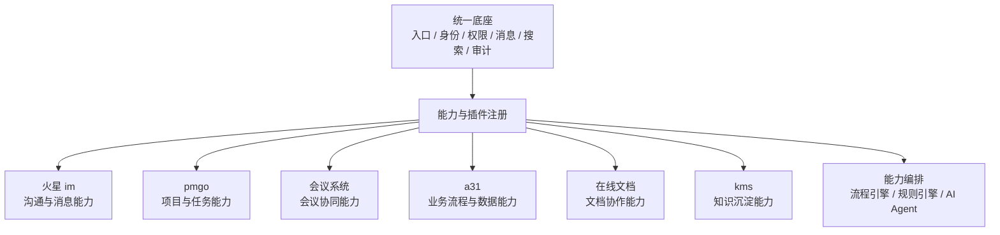
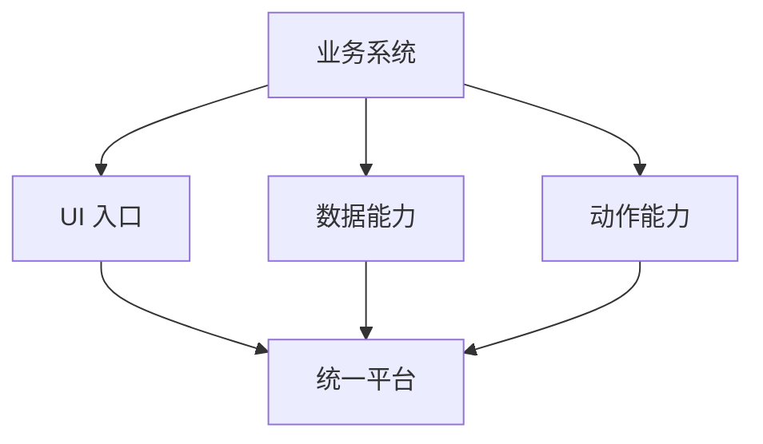
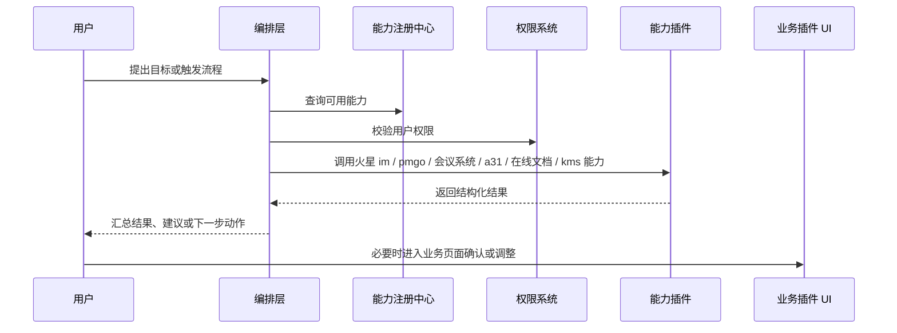
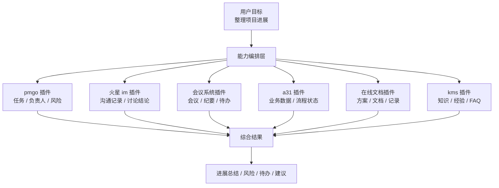
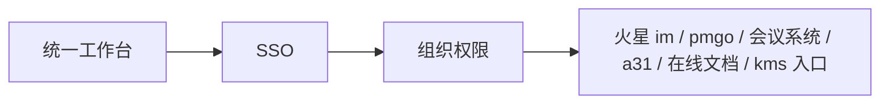
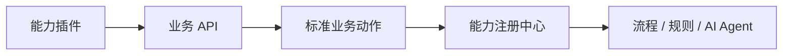

<!-- @format -->

# 对软件一体化的新思考

> 本文属于 [Mod 化 / 插件化设计总览](think.md) 中的“产品方向”维度，用来说明对内软件一体化为什么应从入口聚合，逐步升级为“统一底座 + 能力插件 + 能力编排”。

## 0. 核心判断

对内软件一体化不应只是把火星 im、pmgo、会议系统、a31、在线文档、kms 等系统放到一个入口里。

更合理的方向是：

> 先建设统一入口、身份、组织、权限、消息、搜索和审计等基础底座；再让各项目和服务提供标准化能力与插件；最后再考虑通过流程引擎、规则引擎或 AI Agent 做跨系统能力编排。

可以抽象为：

```text
对内软件一体化 = 统一底座 + 能力插件 + 能力编排
```



这个方向的关键不是“把所有系统重做一遍”，也不是一开始就让 AI Agent 接管所有流程，而是先把现有系统改造成可统一接入、可标准调用、可治理演进的能力插件。

---

## 一、为什么不是简单的入口一体化

传统对内软件一体化，通常是入口聚合：

```text
一个门户
  ├─ 火星 im
  ├─ pmgo
  ├─ 会议系统
  ├─ a31
  ├─ 在线文档
  └─ kms
```

这种方式解决了“入口分散”的问题，但没有真正解决“工作割裂”的问题。

| 问题       | 入口一体化的局限                                   |
| ---------- | -------------------------------------------------- |
| 上下文割裂 | 沟通、项目、会议、业务、文档、知识之间缺少统一理解 |
| 流程割裂   | 用户仍然要手动在多个系统之间复制、查询、推进       |
| 数据难用   | 数据在系统里，但不能直接服务具体目标               |
| 任务不闭环 | 系统只记录信息，不主动推动下一步                   |
| 复用困难   | 新系统接入时，仍然容易变成新的孤岛                 |

如果只做入口聚合，用户仍然需要自己在系统之间搬运信息：

```text
人找系统 -> 人查信息 -> 人整理结果 -> 人推动流程
```

能力插件化以后，系统才有机会进一步走向编排：

```text
人提出目标 -> 编排层找到能力 -> 编排层整合信息 -> 编排层协助推进流程
```

这里的编排层可以是流程引擎、规则引擎，也可以是 AI Agent。AI Agent 的价值在于理解自然语言目标、整合上下文和调用工具，但前提是各系统已经先把能力标准化暴露出来。

所以，一体化的重点要从“统一入口”逐步升级为“统一接入、统一能力、统一编排”。

---

## 二、先让系统从入口变成能力

对内系统接入统一平台时，不应只提供一个页面入口，还应该逐步提供可被平台调用的能力。

可以把每个项目或服务分成三类接入内容：

| 接入内容 | 说明                             | 示例                                         |
| -------- | -------------------------------- | -------------------------------------------- |
| UI 入口  | 人可以继续进入原业务页面操作     | 工作台菜单、详情页、管理页                   |
| 数据能力 | 平台可以查询、检索、汇总业务数据 | 查项目、查会议、查文档、查知识、查业务状态   |
| 动作能力 | 平台可以在授权后触发业务动作     | 建任务、发通知、发起会议、发起审批、更新状态 |



这种转变的意义是：

- 系统不再只是“挂一个入口”，而是提供可复用能力。
- 平台不需要吞并所有业务细节，只负责统一规则和接入边界。
- 后续无论是工作流、自动化还是 AI Agent，都可以基于这些能力做编排。
- 新系统接入时，也能按照统一规范提供入口、数据和动作。

---

## 三、目标架构：统一底座 + 能力插件 + 能力编排

### 3.1 统一底座

统一底座不负责承载所有业务细节，只负责共性能力和接入规则。

| 本体能力        | 作用                                               |
| --------------- | -------------------------------------------------- |
| 统一身份        | 所有插件使用同一套账号                             |
| 组织权限        | 人、部门、岗位、角色、权限统一                     |
| 统一工作台      | 插件统一入口和导航                                 |
| 统一消息 / 待办 | 通知、提醒、任务、会议、审批入口统一               |
| 统一搜索 / 索引 | 跨火星 im、pmgo、会议系统、a31、在线文档、kms 检索 |
| 能力注册中心    | 管理插件声明、能力、权限、版本                     |
| 审计日志        | 记录人、系统和编排层的关键操作                     |

```text
统一底座

┌──────────────────────────────────────────────┐
│ Core                                         │
│ 身份 / 组织 / 权限 / 工作台 / 消息 / 搜索 / 审计│
│                                              │
│   ○ UI 插槽      ○ 数据插槽      ○ 动作插槽    │
└──────┼──────────────┼─────────────┼──────────┘
       │              │             │
   ┌───▼───┐      ┌───▼───┐     ┌───▼────┐
   │业务 UI │      │业务数据│     │业务动作 │
   └───────┘      └───────┘     └────────┘
```

### 3.2 能力插件

每个对内系统都可以先包装为能力插件，而不是一开始重构。

```text
能力插件 = UI 入口 + 数据 API + 业务动作 + 权限声明
```

注意：不是所有插件都必须有 UI。纯工具插件可以没有 UI；但火星 im、pmgo、会议系统、a31、在线文档、kms 这类业务系统，通常应该保留 UI 入口。

原因是：

- 人需要兜底操作。
- 编排结果需要可追溯。
- 写操作需要人工确认。
- 插件权限和配置需要管理入口。
- 员工仍然需要直接使用业务系统。

| 插件         | OA 能力域      | UI 入口                      | 数据能力                       | 动作能力                         |
| ------------ | -------------- | ---------------------------- | ------------------------------ | -------------------------------- |
| 火星 im 插件 | 沟通与消息     | 会话、群聊、消息详情         | 查消息、总结会话、检索沟通记录 | 发通知、提醒人员、推送待办       |
| pmgo 插件    | 项目与任务     | 项目、任务、看板、迭代       | 查项目、查任务、查进度、查风险 | 建任务、改状态、分配负责人       |
| 会议系统插件 | 会议协同       | 会议日程、会议详情、纪要入口 | 查会议、查参会人、查会议纪要   | 发起会议、生成纪要、同步待办     |
| a31 插件     | 业务流程与数据 | 业务页面、数据详情、流程入口 | 查业务数据、查单据、查流程状态 | 发起业务动作、提交审批、更新状态 |
| 在线文档插件 | 文档协作       | 文档、表格、协同编辑         | 查文档、读内容、提取摘要       | 创建文档、更新草稿、共享文档     |
| kms 插件     | 知识沉淀       | 知识库、知识详情、分类目录   | 查知识、查 FAQ、查制度规范     | 发布知识、补充条目、关联资料     |

### 3.3 能力编排层

能力编排层不应该直接连各系统数据库，而应通过插件暴露的 API、Tool 或事件能力调用系统。



编排层负责：

- 根据流程、规则或用户目标选择能力。
- 拉取跨系统上下文。
- 调用合适的插件能力。
- 汇总信息、生成建议或推进下一步。
- 对写操作发起确认或审批。
- 记录调用链路和审计日志。

AI Agent 可以成为能力编排层的一种实现，但它不是第一步。只有当入口、身份、权限、数据能力和动作能力先标准化以后，Agent 才能真正稳定地跨系统工作。

---

## 四、插件声明规范

为了让插件可管理、可调用、可审计，每个能力插件都应该有类似 `plugin.json` 的声明。

示例：pmgo 插件。

```json
{
  "name": "pmgo",
  "displayName": "pmgo",
  "version": "1.0.0",
  "ui": {
    "menus": ["工作台/项目"],
    "pages": ["/projects", "/projects/:id", "/tasks/:id"]
  },
  "apis": ["GET /projects", "GET /tasks", "POST /tasks", "PATCH /tasks/:id/status"],
  "actions": ["list_project_tasks", "create_task", "update_task_status", "summarize_project_progress"],
  "permissions": ["project.read", "task.read", "task.write", "user.read"]
}
```

插件声明要回答四个问题：

| 问题             | 说明                                              |
| ---------------- | ------------------------------------------------- |
| 插件显示在哪里   | 工作台菜单、页面、侧边栏、详情页                  |
| 插件提供什么数据 | 哪些 API 可以被平台、流程或 Agent 调用            |
| 插件提供什么动作 | 哪些业务动作可以被流程引擎、规则引擎或 Agent 调用 |
| 插件需要什么权限 | 读、写、导出、通知、审批等权限                    |

---

## 五、典型工作流

以“生成某项目本周进展”为例。

```text
用户：
帮我整理 A 项目本周进展，列出风险和待办。

编排层调用：
1. pmgo 插件：查询项目任务、负责人、延期项、风险项
2. 火星 im 插件：检索项目群相关讨论
3. 会议系统插件：读取项目会议、会议纪要和会议待办
4. a31 插件：查询相关业务数据、单据和流程状态
5. 在线文档插件：读取项目文档、方案和记录
6. kms 插件：补充相关知识、制度、历史经验和 FAQ

编排层输出：
项目进展总结 + 风险点 + 待办事项 + 责任人 + 建议动作
```



这个场景能验证最核心的能力：

- 编排层能否识别任务目标或流程目标。
- 插件是否能提供可调用的数据和动作。
- 权限是否能被统一校验。
- 跨系统上下文能否被整合。
- 输出结果能否追溯到原始来源。

---

## 六、落地路径

不建议一开始重做所有系统，也不建议直接建设大而全平台。可以分阶段推进。

### 6.1 第一阶段：统一入口和身份

目标：先把系统接进来。

- 建统一工作台。
- 接入统一 SSO。
- 接入组织、部门、角色、权限。
- 把火星 im、pmgo、会议系统、a31、在线文档、kms 作为入口插件挂进来。
- 建立最基础的插件注册信息。



### 6.2 第二阶段：统一查询和索引

目标：让平台先能读。

- 每个插件补只读 API。
- 建跨系统搜索索引。
- 对火星 im、pmgo、会议系统、a31、在线文档、kms 建立统一检索。
- 编排层先做查询、总结、归纳，不做写操作。

### 6.3 第三阶段：能力动作化

目标：让业务插件可被平台、流程或 Agent 调用。

- 给高频插件封装标准业务动作。
- 建能力注册中心。
- 对数据能力和动作能力做权限校验。
- 先做“项目进展总结”“会议纪要生成”“待办汇总”等 PoC。



### 6.4 第四阶段：受控写操作

目标：让编排层能协助推进流程，但不越权。

- 允许编排层创建任务、发送通知、发起审批。
- 所有写操作必须先让用户确认。
- 关键操作记录审计日志。
- 对高风险操作设置审批或二次确认。

```text
编排层建议操作 -> 用户确认 -> 权限校验 -> 执行写操作 -> 记录审计日志
```

### 6.5 第五阶段：插件规范化

目标：让后续系统按插件方式接入。

- 沉淀 `plugin.json` 规范。
- 沉淀插件 SDK。
- 沉淀 UI 插槽规范。
- 沉淀 API / Action / Tool 接入规范。
- 建插件版本、权限、日志、下线机制。

---

## 七、最小 PoC 建议

建议优先选一个高频、跨系统、价值清晰的场景：

> 生成某项目本周进展，并列出风险、待办和责任人。

最小接入范围：

| 插件         | 最小能力                           |
| ------------ | ---------------------------------- |
| pmgo 插件    | 查询项目任务、状态、负责人、延期项 |
| 火星 im 插件 | 检索项目群讨论记录                 |
| 会议系统插件 | 读取项目会议和会议纪要             |
| a31 插件     | 查询相关业务数据和流程状态         |
| 在线文档插件 | 读取项目文档和方案                 |
| kms 插件     | 查询相关知识、制度和历史经验       |

第一版 PoC 只做读操作：

- 不自动创建任务。
- 不自动发通知。
- 不自动修改业务数据。
- 输出结果必须带来源链接。

这样可以先验证一体化的核心价值：

> 编排层是否能跨插件理解上下文、调用能力、整合结果，并让人能追溯来源。第一阶段可以由固定流程或规则实现，成熟后再引入 AI Agent 做更灵活的目标理解和任务编排。

---

## 八、阶段性结论

对内软件一体化的本质不是做一个更大的 OA，也不是只做一个统一门户，而是建设一个可接入、可调用、可治理、可编排的办公能力平台。

更准确的表达是：

> 统一底座负责入口、身份、权限、工作台、消息、搜索、审计和能力注册；火星 im、pmgo、会议系统、a31、在线文档、kms 等系统作为能力插件接入，分别承载沟通消息、项目任务、会议协同、业务流程、文档协作和知识沉淀；流程引擎、规则引擎或 AI Agent 在上层负责整合上下文、调用插件能力、协助推进任务闭环。

这个方向下，对内软件的一体化重点不再是“功能合并”，而是：

1. 业务系统插件化。
2. 数据和动作可调用。
3. 上下文可整合。
4. 操作可确认、可审计。
5. 编排层能跨插件推进任务。
