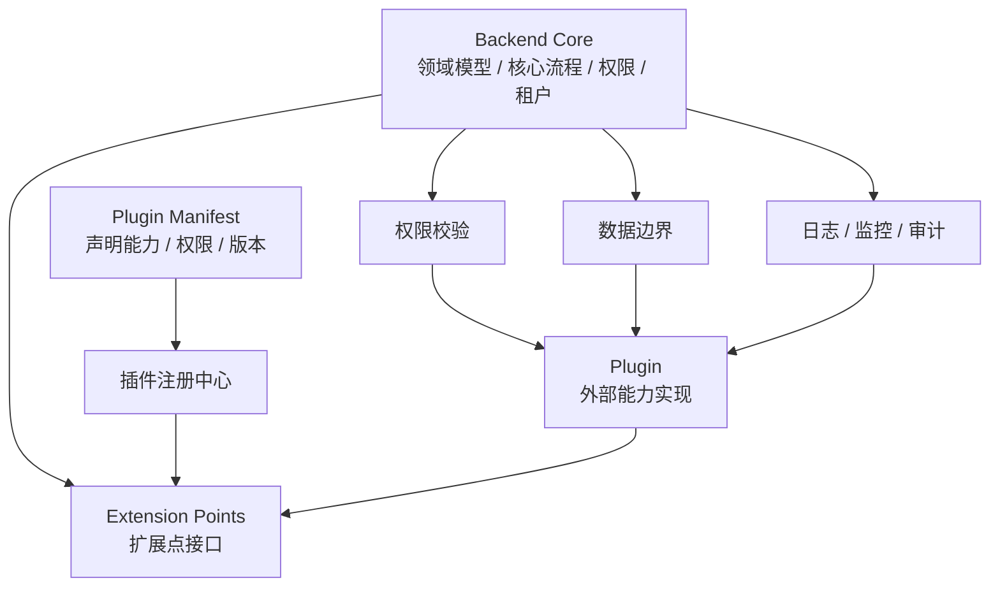
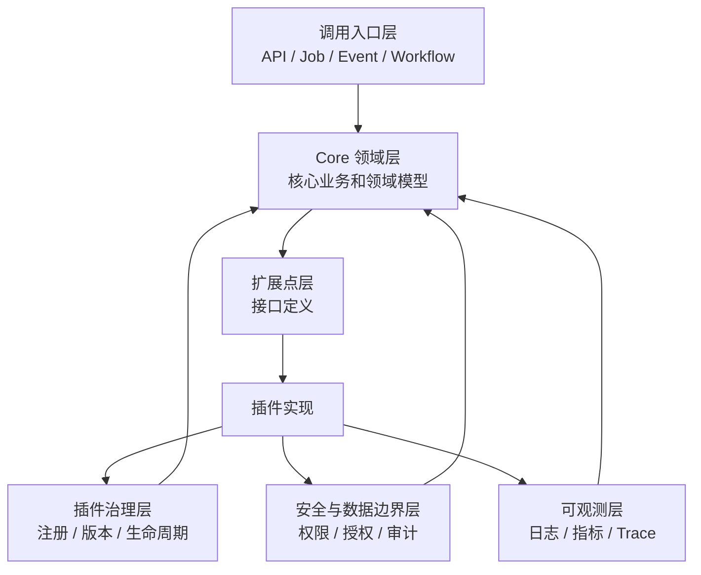
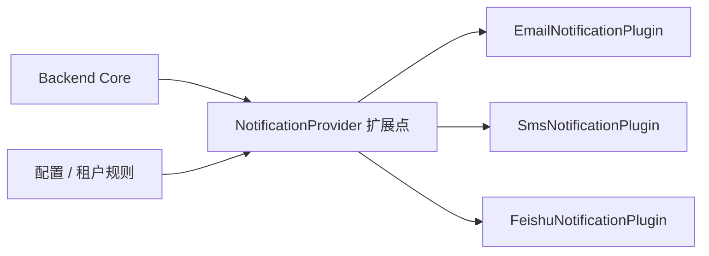
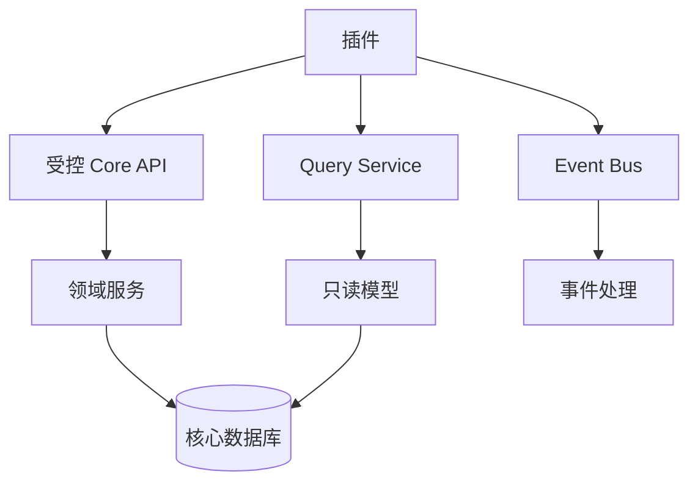
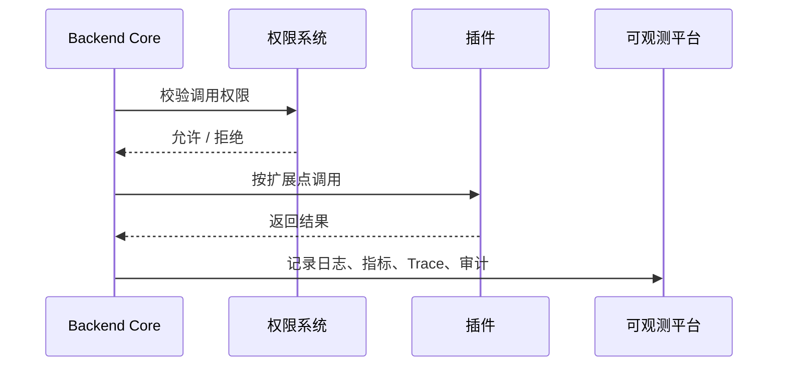

<!-- @format -->

# 从后端看 Mod 化 / 插件化设计

## 0. 核心判断

后端也需要 Mod 化 / 插件化，但后端关注点和 PC、移动端、ToC 产品不一样。

更准确的方向是：

> 后端插件化不是让系统随意动态加载代码，而是让 Core 保持稳定，通过清晰的接口、声明、权限、数据边界和生命周期治理，把外部能力受控接入。

可以抽象为：

```text
后端插件化 = Backend Core + Extension Points 扩展点 + Plugin Manifest 声明 + Permission 权限 + Data Boundary 数据边界 + Observability 可观测
```



这类设计的重点是：

- **接口边界清晰**：Core 只依赖扩展点接口，不依赖具体实现。
- **数据访问受控**：插件不能随意读写核心数据库。
- **权限声明明确**：插件需要什么权限必须提前声明和校验。
- **生命周期可治理**：插件要能注册、启用、禁用、升级、回滚、下线。
- **调用过程可观测**：每次调用要能追踪、监控、审计和告警。

---

## 一、后端为什么需要模块化 / 插件化

后端系统发展到一定阶段，通常会遇到几个问题：

| 问题 | 表现 |
| --- | --- |
| 业务能力堆叠 | 所有逻辑都写进主服务，代码越来越重 |
| 多实现切换困难 | 通知、支付、认证、导出、数据源等能力经常有多个实现 |
| 客户差异明显 | 不同租户、客户、地区需要不同策略和连接器 |
| 外部系统接入频繁 | 企业系统、第三方 API、数据源不断变化 |
| 风险边界不清 | 插件或扩展逻辑可能越权访问核心数据 |
| 变更影响面大 | 一个非核心能力变更也要重新发布主服务 |

因此，后端插件化的目标不是“炫技式动态加载”，而是解决后端长期演进中的扩展和治理问题。

```text
不推荐：
所有能力都写进 Core
所有实现都硬编码
所有扩展都直接访问核心表

推荐：
Core 定义扩展点
插件声明能力和权限
插件通过接口和受控 API 接入
调用过程可监控、可审计、可回滚
```

---

## 二、先区分模块化、接口化、配置化、插件化、微服务

后端讨论插件化时，容易把几个概念混在一起。

| 方式 | 解决什么问题 | 典型特征 | 适合场景 |
| --- | --- | --- | --- |
| 模块化 | 代码组织问题 | 代码按领域或能力拆分，但通常随主服务发布 | 核心业务、稳定能力 |
| 接口化 | 依赖边界问题 | Core 依赖接口，不依赖具体实现 | 多实现切换 |
| 配置化 | 行为选择问题 | 通过配置选择策略、开关、实现 | 租户差异、灰度、策略调整 |
| 插件化 | 外部能力接入问题 | 插件按接口和声明注册，可启停、替换、治理 | 连接器、策略、通知、导入导出 |
| 微服务化 | 部署和组织边界问题 | 独立服务、独立部署、独立扩缩容 | 强边界、高独立性业务 |

关键判断：

> 微服务不等于插件化。  
> 微服务强调部署边界，插件化强调扩展点和接入治理。

后端演进通常可以按这个顺序：


---

## 三、后端插件化的通用架构

后端插件化可以拆成六层：

```text
后端插件化架构

┌──────────────────────────────────────────────┐
│ 调用入口层                                    │
│ API / Job / Event / Workflow / Agent Tool     │
├──────────────────────────────────────────────┤
│ Core 领域层                                   │
│ 领域模型 / 核心流程 / 租户 / 权限 / 事务       │
├──────────────────────────────────────────────┤
│ 扩展点层                                      │
│ Provider / Connector / Strategy / Action      │
├──────────────────────────────────────────────┤
│ 插件治理层                                    │
│ 注册中心 / Manifest / 生命周期 / 版本 / 回滚   │
├──────────────────────────────────────────────┤
│ 安全与数据边界层                              │
│ 权限校验 / 数据授权 / 审计 / 隔离              │
├──────────────────────────────────────────────┤
│ 可观测层                                      │
│ 日志 / 指标 / Trace / 告警 / 调用记录          │
└──────────────────────────────────────────────┘
```



各层职责：

| 层级 | 职责 | 关键问题 |
| --- | --- | --- |
| 调用入口层 | API、任务、事件、工作流、Agent Tool 的入口 | 谁在触发插件调用 |
| Core 领域层 | 承载核心业务、领域模型、事务边界 | 什么必须稳定在 Core |
| 扩展点层 | 定义插件可以实现的接口 | 哪些能力允许扩展 |
| 插件治理层 | 管理注册、启停、版本、升级、回滚 | 插件是否可治理 |
| 安全与数据边界层 | 控制权限、数据访问、审计 | 插件是否越权 |
| 可观测层 | 记录调用、耗时、错误、告警 | 插件是否可追踪 |

---

## 四、后端适合插件化哪些能力

后端适合插件化的是：变化快、多实现、边界清楚、可替换、可独立治理的能力。

| 插件类型 | 示例 | 为什么适合插件化 |
| --- | --- | --- |
| 通知插件 | 邮件、短信、企微、飞书、钉钉 | 渠道多，容易替换 |
| 支付插件 | 微信、支付宝、Stripe、PayPal | 多渠道，多地区差异明显 |
| 认证插件 | OAuth、LDAP、SSO、企业身份源 | 客户差异明显 |
| 数据源插件 | MySQL、PostgreSQL、S3、企业 API | 外部系统接入频繁 |
| 导入导出插件 | CSV、Excel、PDF、Word | 格式多，变化快 |
| 策略插件 | 推荐、风控、匹配、定价、排序 | 策略变化快，需要实验 |
| 工作流插件 | 审批动作、任务动作、归档动作 | 流程扩展多 |
| AI Tool 插件 | 查任务、查档案、查知识库、查业务数据 | 适合被 Agent 编排调用 |

不建议一开始插件化的能力：

| 不建议插件化 | 原因 |
| --- | --- |
| 主领域模型 | 领域边界不稳定，容易破坏核心一致性 |
| 核心交易链路 | 风险高，强一致性要求高 |
| 高频低延迟路径 | 插件层可能带来性能损耗 |
| 未定义权限边界的数据访问 | 容易越权和泄露 |
| 强事务写入逻辑 | 插件失败会影响主流程一致性 |

---

## 五、扩展点先行：不要先写插件

后端插件化最重要的是先定义扩展点，而不是先写插件实现。

常见扩展点：

```text
NotificationProvider
PaymentProvider
AuthProvider
DataConnector
ExportProvider
WorkflowAction
RiskStrategy
PricingStrategy
AgentToolProvider
```

扩展点应该明确：

| 问题 | 说明 |
| --- | --- |
| 输入是什么 | 插件调用需要哪些参数 |
| 输出是什么 | 插件返回什么结构 |
| 是否允许写操作 | 是否会修改数据或触发外部动作 |
| 是否需要事务 | 是否参与 Core 的事务边界 |
| 是否可以失败 | 失败时中断主流程还是降级 |
| 是否可重试 | 超时、异常时是否允许重试 |

示意：



---

## 六、插件声明：让接入可管理

后端插件也应该有类似 `plugin.json` 的声明文件。

示例：通知插件。

```json
{
  "name": "email-notification",
  "displayName": "邮件通知插件",
  "version": "1.0.0",
  "extensionPoint": "notification.provider",
  "entry": "EmailNotificationProvider",
  "permissions": ["user.read", "message.send"],
  "configSchema": {
    "smtpHost": "string",
    "smtpPort": "number",
    "fromAddress": "string"
  },
  "capabilities": ["send_email", "send_template_email"],
  "compatibility": {
    "coreVersion": ">=1.5.0"
  }
}
```

插件声明要回答六个问题：

| 问题 | 说明 |
| --- | --- |
| 它是谁 | 插件名称、版本、描述 |
| 实现什么扩展点 | 例如通知、支付、导出、数据源 |
| 入口在哪里 | 类名、服务地址、函数名或容器入口 |
| 需要什么权限 | 读用户、发消息、访问文件、调用外部服务 |
| 需要什么配置 | API Key、连接串、渠道参数 |
| 兼容什么版本 | Core 版本、协议版本、依赖版本 |

插件声明的价值：

- Core 可以提前识别插件能力。
- 权限可以在启用前审核。
- 配置可以统一管理。
- 版本兼容可以被约束。
- 插件可以被注册、禁用、下线。

---

## 七、数据边界：插件不要直接读写核心表

后端插件化最容易出问题的是数据边界。

不推荐：

```text
Plugin -> 直接读写核心数据库表
```

推荐：

```text
Plugin -> Core API / Domain Service / Query Service / Event Bus
```



数据边界设计原则：

| 原则 | 说明 |
| --- | --- |
| 最小权限 | 插件只访问完成任务所需的数据 |
| 读写分离 | 优先给插件只读能力，写操作更谨慎 |
| 通过服务访问 | 插件通过 API 或领域服务访问数据 |
| 避免直接连表 | 不允许插件绕过领域规则直接改表 |
| 写操作审计 | 任何写操作都要记录谁、何时、改了什么 |
| 可降级 | 插件失败不能破坏核心主流程 |

---

## 八、权限、安全和租户隔离

后端插件的权限边界必须比前端更严格，因为它可能访问业务数据和外部系统。

需要控制的权限包括：

| 权限类型 | 示例 |
| --- | --- |
| 数据权限 | 读用户、读任务、读订单、读档案 |
| 写操作权限 | 建任务、发通知、改状态、发起审批 |
| 外部调用权限 | 调用第三方 API、发送短信、调用支付渠道 |
| 文件权限 | 读取文件、导出文件、生成报表 |
| 租户权限 | 插件是否对某个租户启用 |
| 管理权限 | 安装、启用、禁用、配置插件 |

权限校验应该发生在多个阶段：


安全原则：

- 插件权限必须显式声明。
- 高风险权限需要人工审核。
- 多租户系统中，插件启用范围必须按租户隔离。
- 插件调用外部系统时，密钥由平台托管，不应散落在插件代码里。
- 插件异常不能泄露敏感数据。

---

## 九、生命周期和治理

后端插件不是“注册一次就结束”，而是需要完整生命周期。

```text
开发 -> 打包 -> 提交 -> 审核 -> 注册 -> 配置 -> 启用 -> 运行 -> 监控 -> 升级 -> 回滚 -> 下线
```


治理重点：

| 治理项 | 说明 |
| --- | --- |
| 安装审核 | 检查权限、依赖、版本、风险 |
| 配置管理 | API Key、渠道参数、租户开关 |
| 启停控制 | 插件可按租户、环境、场景启停 |
| 版本管理 | 插件版本和 Core 版本要兼容 |
| 回滚机制 | 插件异常时可快速回退 |
| 下线机制 | 老版本插件要能安全下线 |
| 依赖治理 | 插件依赖的外部服务要可监控 |

---

## 十、可观测：插件调用必须可追踪

后端插件调用必须可观测，否则出了问题很难定位。

每次插件调用至少记录：

| 记录项 | 说明 |
| --- | --- |
| 调用方 | 用户、系统任务、事件、Agent |
| 插件信息 | 插件名称、版本、扩展点 |
| 输入摘要 | 参数摘要，避免记录敏感明文 |
| 输出摘要 | 返回结果摘要 |
| 耗时 | 插件执行时间 |
| 状态 | 成功、失败、超时、降级 |
| 权限结果 | 是否通过权限校验 |
| TraceId | 关联完整调用链路 |



可观测的价值：

- 插件慢了能发现。
- 插件失败能告警。
- 插件越权能拦截。
- 插件影响主流程能定位。
- 插件升级后能对比效果。

---

## 十一、结合前面场景的后端表达

### 11.1 对内办公软件

对内办公一体化中，聊天、办公、A32、档案、任务管理可以作为业务插件接入。

后端需要重点处理：

```text
统一身份 / 权限 / 组织
插件注册中心
跨系统数据查询接口
Agent Tool 注册
审计日志
写操作确认和权限校验
```

例如“生成项目进展”：

```text
Agent -> Tool Registry -> 任务插件 / 聊天插件 / 文档插件 / A32 插件
      -> 权限校验 -> 调用插件 -> 汇总结果 -> 记录审计
```

### 11.2 ToC 产品

ToC 产品后端可以把推荐、风控、内容处理、权益、活动等能力模块化。

后端需要重点处理：

```text
人群规则
权益配置
AB 实验
灰度发布
策略插件
活动配置
```

这些能力不一定表现为“插件市场”，但后端应具备可配置、可替换、可实验的扩展能力。

### 11.3 移动端

移动端很多能力应尽量服务端化，后端成为移动端受控扩展的能力承载层。

后端需要重点处理：

```text
远程配置
功能开关
降级策略
按版本开放
按地区开放
服务端内容处理
搜索 / 推荐 / 数据分析
```

移动端不自由开放插件，但后端可以通过配置和服务端能力支持移动端轻量扩展。

---

## 十二、落地路径

后端插件化不建议一开始建设大而全平台，可以分阶段推进。


### 12.1 模块化

- 按领域和能力拆分代码。
- 区分 Core 能力和可变能力。
- 先减少硬编码和循环依赖。

### 12.2 接口化

- 为多实现能力定义接口。
- Core 依赖接口，不依赖具体实现。
- 先从通知、导出、认证、数据源等边界清晰能力开始。

### 12.3 配置化

- 通过配置选择实现。
- 支持租户、环境、人群、场景差异。
- 支持灰度和回滚。

### 12.4 插件声明和注册

- 增加 `plugin.json` 或等价声明。
- 建插件注册中心。
- 管理插件能力、权限、版本和配置。

### 12.5 权限和数据边界

- 插件权限显式声明。
- 插件通过受控 API 访问数据。
- 高风险操作必须审计。

### 12.6 生命周期和可观测

- 插件可启停、升级、回滚、下线。
- 每次调用记录日志、指标、Trace。
- 异常时可降级，不破坏核心流程。

---

## 十三、阶段性结论

后端 Mod 化 / 插件化的本质不是动态加载代码，而是建立一套受控扩展机制。

更准确的表达是：

> Backend Core 保持稳定，扩展点定义接入边界，插件通过声明注册，数据访问通过受控 API，权限和租户严格校验，调用过程可观测、可审计、可回滚。

和前面几个视角对齐，可以这样理解：

| 视角 | 插件化重点 |
| --- | --- |
| PC 软件 | Extension Host、UI 插槽、插件运行环境 |
| 移动端 | 受控模块、轻量插槽、配置化、性能和权限强约束 |
| ToC 产品 | 能力模块、场景包、运营配置、用户体验简单化 |
| 对内办公软件 | 业务系统插件化、Agent 编排、统一身份和审计 |
| 后端 | 接口、声明、数据边界、权限、生命周期、可观测 |

最终，后端插件化要做到：

- Core 不被非核心能力拖重。
- 新能力可以按扩展点接入。
- 插件不能越权访问数据。
- 插件异常可以降级或回滚。
- 插件调用全链路可追踪。
