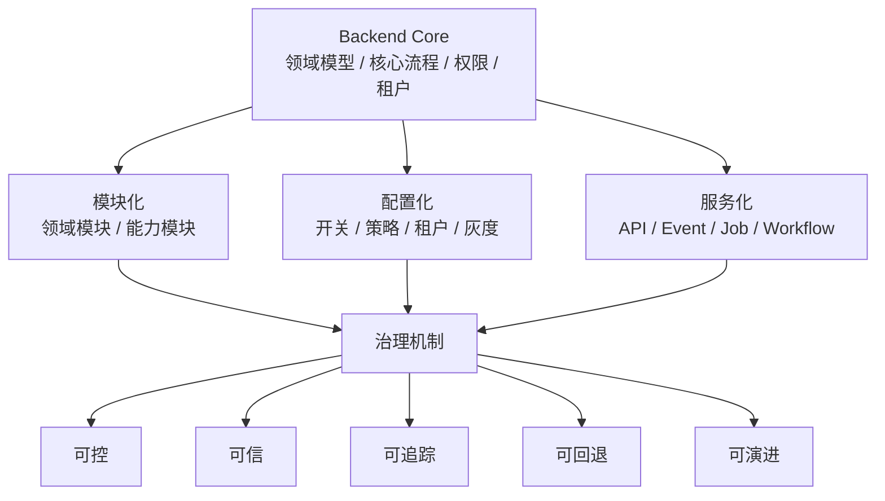
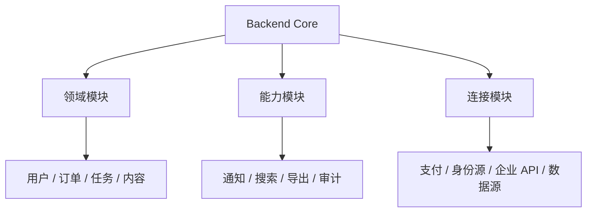
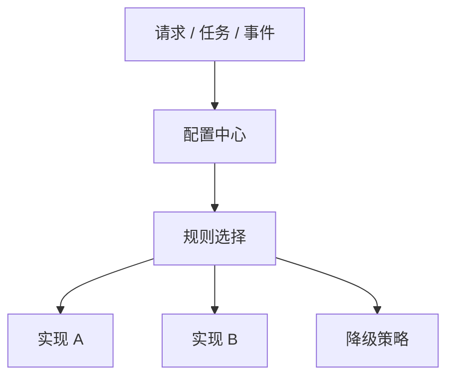
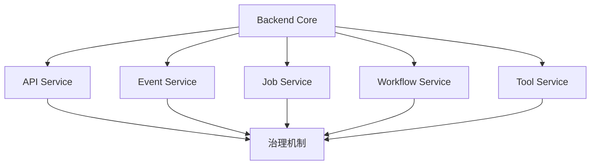

<!-- @format -->

# 从后端看 Mod 化设计

> 本文属于 [Mod 化 / 插件化设计总览](think.md) 中的“具体实现”维度，用来说明后端 Mod 化不应被理解为动态插件平台，而应先围绕模块化、配置化、服务化和治理机制来设计。

## 0. 核心判断

后端也需要 Mod 化，但后端的重点和 PC、移动端不一样。

更准确的方向是：

> 后端 Mod 化的核心不是让系统动态加载插件，而是通过模块化拆清业务边界，通过配置化承载差异策略，通过服务化承载独立能力，再用治理机制保证能力可控、可信、可追踪、可回退、可演进。

可以抽象为：

```text
后端 Mod 化 = 模块化 + 配置化 + 服务化 + 治理机制
```



这个方向的关键不是“后端也做插件市场”，而是让后端能力可以拆得开、配得动、接得住、管得住。

---

## 一、为什么后端 Mod 不应先讲插件化

后端系统发展到一定阶段，通常会遇到这些问题：

| 问题             | 表现                                               |
| ---------------- | -------------------------------------------------- |
| 业务能力堆叠     | 所有逻辑都写进主服务，代码越来越重                 |
| 多实现切换困难   | 通知、支付、认证、导出、数据源等能力经常有多个实现 |
| 客户差异明显     | 不同租户、客户、地区需要不同策略                   |
| 外部系统接入频繁 | 企业系统、第三方 API、数据源不断变化               |
| 变更影响面大     | 一个非核心能力变更也要重新发布主服务               |
| 风险边界不清     | 扩展逻辑可能越权访问核心数据                       |

如果一开始就讲“插件化”，容易让人误解成：

```text
动态加载代码
建设插件市场
所有能力都做成插件
运行时随意插拔业务逻辑
```

这不是后端最应该优先追求的方向。

更稳的路径是：

```text
先模块化：把业务和能力边界拆清楚
再配置化：把差异策略从代码里抽出来
再服务化：把独立能力变成 API / Event / Job / Workflow
最后治理化：让能力可控、可信、可追踪、可回退、可演进
```

---

## 二、模块化：先把边界拆清楚

模块化解决的是代码组织和领域边界问题。

后端模块化不是简单按文件夹分类，而是要明确：

| 问题           | 说明                                         |
| -------------- | -------------------------------------------- |
| 哪些是核心领域 | 订单、用户、任务、内容、项目、资产等核心对象 |
| 哪些是通用能力 | 通知、导出、搜索、文件、权限、审计等能力     |
| 哪些是策略能力 | 推荐、风控、定价、排序、匹配等策略           |
| 哪些是外部连接 | 第三方系统、企业系统、支付渠道、数据源       |

可以先按三类模块拆：

| 模块类型 | 说明                   | 示例                               |
| -------- | ---------------------- | ---------------------------------- |
| 领域模块 | 承载核心业务对象和规则 | 用户、订单、任务、项目、内容       |
| 能力模块 | 承载可复用能力         | 通知、搜索、导入导出、文件、审计   |
| 连接模块 | 承载外部系统接入       | 支付渠道、身份源、企业 API、数据源 |



模块化的目标是：

1. Core 不被非核心能力拖重。
2. 模块之间依赖关系清晰。
3. 可变能力可以独立演进。
4. 后续配置化、服务化有清晰边界。

---

## 三、配置化：把差异从代码里抽出来

配置化解决的是行为选择和差异控制问题。

后端很多变化不是能力本身变化，而是开放规则、策略、租户差异变化。

常见配置类型：

| 配置类型 | 说明                 | 示例                           |
| -------- | -------------------- | ------------------------------ |
| 功能开关 | 控制能力是否启用     | 某租户是否启用新版导出         |
| 租户配置 | 控制不同客户差异     | A 客户用企业微信，B 客户用飞书 |
| 策略配置 | 控制算法、规则、阈值 | 风控阈值、排序策略、推荐策略   |
| 灰度配置 | 控制逐步开放         | 先给 5% 用户启用新能力         |
| 权益配置 | 控制额度和权限       | 免费版导出 10 次，专业版不限   |
| 降级配置 | 控制异常时兜底       | 外部服务异常时切换备用渠道     |



配置化的价值是：

- 减少硬编码。
- 减少因为策略变化频繁发版。
- 支持租户、地区、人群、版本差异。
- 支持灰度、实验和回滚。
- 让能力模块可以被更灵活地组合和开放。

---

## 四、服务化：把独立能力承载出去

服务化解决的是能力边界、部署边界和扩展边界问题。

有些能力不适合继续留在主服务里：

| 能力特征   | 为什么适合服务化                   |
| ---------- | ---------------------------------- |
| 计算重     | 会影响主服务性能                   |
| 依赖复杂   | 依赖外部系统、模型、文件、任务队列 |
| 变化频繁   | 独立发布更安全                     |
| 边界清晰   | 可以通过 API、事件或任务调用       |
| 多系统复用 | 不只服务一个业务系统               |

服务化不等于一定要拆微服务，也可以有多种形态：

| 服务形态      | 说明                              | 示例                           |
| ------------- | --------------------------------- | ------------------------------ |
| API 服务      | 同步调用能力                      | 查询、校验、计算、生成         |
| Event 服务    | 事件驱动能力                      | 订单完成后通知、内容发布后审核 |
| Job 服务      | 异步任务能力                      | 批量导出、报表生成、数据同步   |
| Workflow 服务 | 流程编排能力                      | 审批、归档、跨系统任务         |
| Tool 服务     | 面向 Agent 或自动化调用的工具能力 | 查任务、查知识、查业务数据     |



当一个服务通过声明、注册、权限校验和受控 API 接入 Core 时，它可以被看作“服务型插件”。但这个概念是服务化成熟后的治理表达，不是第一步目标。

---

## 五、治理机制：让能力可控、可信、可持续

模块化、配置化、服务化之后，如果没有治理，很容易变成另一种混乱。

治理机制在方向层面先回答五个问题：

| 治理目标 | 要解决的问题                             |
| -------- | ---------------------------------------- |
| 可控     | 哪些能力能被谁启用、调用、关闭           |
| 可信     | 能力调用是否经过授权，是否符合数据边界   |
| 可追踪   | 出问题时能否知道谁调用了什么、影响了什么 |
| 可回退   | 能力异常时能否降级、关闭、回滚           |
| 可演进   | 能力升级、替换、下线是否不影响 Core      |

对应到工程落地，可以拆成几个维度：

| 治理维度 | 关注点                                           |
| -------- | ------------------------------------------------ |
| 权限     | 谁能调用、调用什么、是否允许写操作               |
| 数据边界 | 能力通过什么接口访问数据，是否绕过领域规则       |
| 生命周期 | 能力如何注册、启用、升级、回滚、下线             |
| 可观测   | 调用链路、耗时、错误、审计、告警是否可追踪       |
| 降级回滚 | 外部依赖异常或能力失败时，主流程是否还能稳定运行 |

这里不需要一开始展开成完整技术方案。方向上先明确：只要能力被模块化、配置化、服务化，就必须有相应治理，否则只是把复杂度从 Core 转移到了模块、配置和服务里。

---

## 六、落地路径

后端 Mod 化不建议一开始建设大而全插件平台，可以分阶段推进。


### 6.1 模块化

- 按领域和能力拆分代码。
- 区分核心领域、通用能力、外部连接。
- 先减少硬编码和循环依赖。

### 6.2 配置化

- 通过配置控制开关、策略、租户差异。
- 支持灰度、实验、回滚和降级。
- 把变化频繁的策略从代码里抽出来。

### 6.3 服务化

- 将边界清晰、复用价值高、计算重或依赖复杂的能力服务化。
- 支持 API、Event、Job、Workflow、Tool 等形态。
- 先从通知、导出、搜索、数据同步、内容处理等能力开始。

### 6.4 治理机制

- 明确能力启用、调用、关闭的控制规则。
- 明确能力调用的可信边界。
- 明确问题发生后的追踪、降级和回退方式。
- 明确能力升级、替换、下线时对 Core 的影响控制。

### 6.5 能力声明和注册

当模块化、配置化、服务化逐步成熟后，再沉淀能力声明和注册机制。

能力声明可以包括：

| 声明项   | 说明                          |
| -------- | ----------------------------- |
| 能力名称 | 它是谁                        |
| 能力入口 | API、事件、任务、工作流、工具 |
| 权限要求 | 需要哪些读写权限              |
| 配置项   | 需要哪些参数、密钥、策略      |
| 版本兼容 | 适配哪些 Core 版本或协议版本  |
| 负责人   | 出问题由谁维护                |

---

## 七、阶段性结论

后端 Mod 化的本质不是动态加载代码，而是建立一套可拆分、可配置、可服务化、可治理的能力体系。

更准确的表达是：

> 模块化负责拆清边界，配置化负责承载差异，服务化负责独立能力，治理机制负责让能力可控、可信、可追踪、可回退、可演进。能力声明和注册可以作为后续治理手段，但不应该成为后端 Mod 的第一主线。

最终，后端 Mod 化要做到：

1. Core 不被非核心能力拖重。
2. 业务和能力边界清晰。
3. 差异策略可以配置。
4. 独立能力可以服务化承载。
5. 能力启用、调用、异常、升级和下线都有治理机制。
