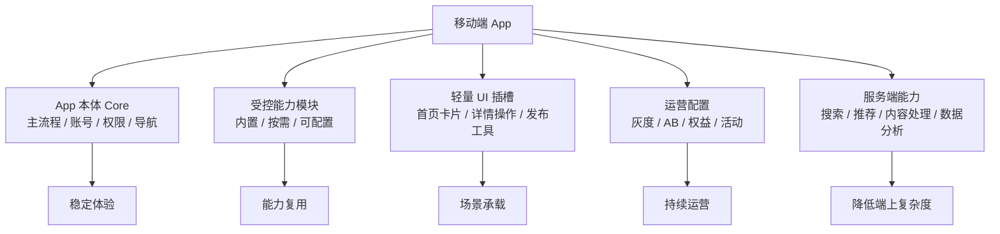
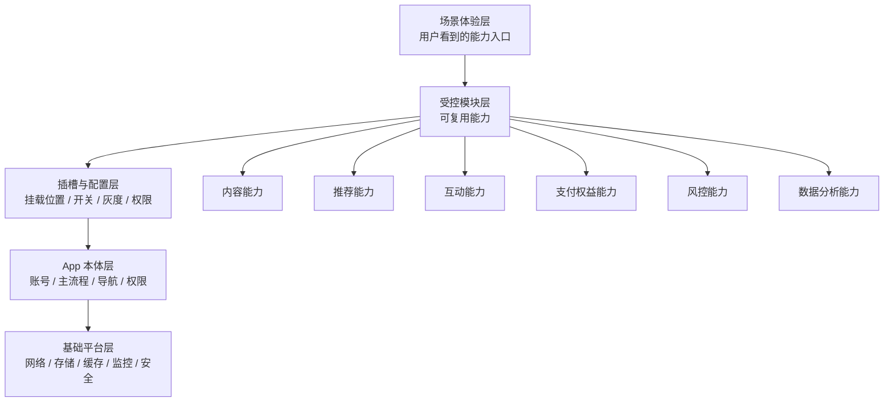
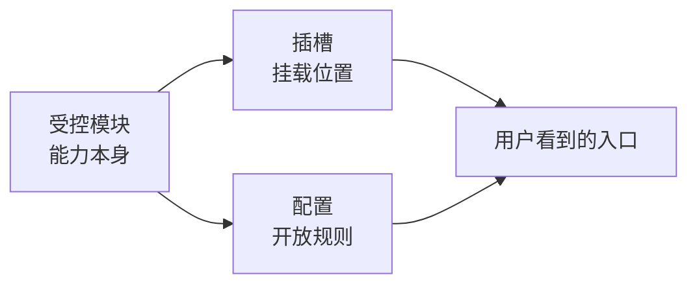
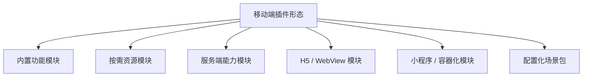
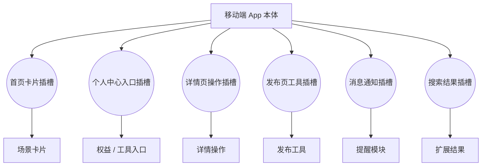
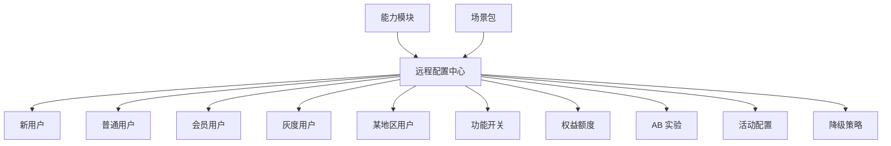

<!-- @format -->

# 从移动端看 Mod 化 / 插件化设计

## 0. 核心判断

移动端也可以用 Mod 化 / 插件化思路设计，但不能照搬 PC 软件那种相对自由的插件体系。

更准确的方向是：

> 移动端插件化应该是“受控模块化”，即 App 本体保持轻量稳定，能力通过内置模块、配置开关、场景包、服务端能力和受限插槽扩展，而不是让用户或第三方随意安装和运行插件。

可以抽象为：

```text
移动端插件化 = App 本体 Core + 受控能力模块 Modules + 轻量 UI 插槽 Slots + 运营配置 Config + 服务端能力 Services
```



这类设计的重点是：

- **插件化受限**：不能随意动态下发和运行不受控代码。
- **架构上模块化**：把能力拆成可复用、可替换、可组合的模块。
- **交付上轻量化**：控制包体、启动速度、内存、电量和网络消耗。
- **体验上场景化**：用户看到的是场景能力，不是插件系统。
- **运营上配置化**：通过灰度、AB、权益、活动控制能力开放。

---

## 一、为什么移动端不能太自由

移动端和 PC 软件最大的区别是：运行环境更封闭，用户耐心更低，平台约束更多。

| 约束 | 对插件化的影响 |
| --- | --- |
| 应用市场审核 | 不能像 PC 一样自由下载和执行任意扩展代码 |
| 包体大小敏感 | 功能堆叠会影响下载、安装和更新转化 |
| 冷启动敏感 | 模块过多会拖慢启动，影响留存 |
| 内存和电量敏感 | 插件后台运行、频繁唤醒会影响体验 |
| 权限敏感 | 相册、定位、通讯录、通知、麦克风等权限必须受控 |
| UI 空间有限 | 插槽过多会让界面拥挤、路径混乱 |
| 网络不稳定 | 动态能力要考虑缓存、降级和离线体验 |
| 隐私风险高 | 用户数据、设备信息、行为数据需要严格边界 |

因此，移动端插件化不应该理解为：

```text
用户自由安装插件
插件自由运行代码
插件自由访问系统能力
插件自由改动主界面
```

更合理的理解是：

```text
官方或受控模块
通过声明和配置接入
在有限插槽内展示
按场景和人群开放
敏感能力统一授权和审计
```

---

## 二、移动端插件化的通用架构

移动端可以拆成五层：

```text
移动端 App 架构

┌──────────────────────────────────────────────┐
│ 场景体验层                                    │
│ 首页卡片 / 详情操作 / 发布工具 / 会员权益 / 活动 │
├──────────────────────────────────────────────┤
│ 受控模块层                                    │
│ 内容 / 推荐 / 互动 / 支付权益 / 风控 / AI 能力   │
├──────────────────────────────────────────────┤
│ 插槽与配置层                                  │
│ UI 插槽 / 功能开关 / 灰度 / AB / 权限声明       │
├──────────────────────────────────────────────┤
│ App 本体层                                    │
│ 账号 / 主导航 / 主流程 / 数据 / 权限 / 消息      │
├──────────────────────────────────────────────┤
│ 基础平台层                                    │
│ 网络 / 存储 / 缓存 / 埋点 / 崩溃 / 安全 / 更新   │
└──────────────────────────────────────────────┘
```



各层职责：

| 层级 | 职责 | 关键问题 |
| --- | --- | --- |
| 基础平台层 | 网络、存储、缓存、监控、安全、更新 | App 是否稳定、可观测、可降级 |
| App 本体层 | 主流程、账号、权限、导航、消息 | 什么必须保持稳定和轻量 |
| 插槽与配置层 | 控制模块挂载、可见性、灰度和权限 | 模块是否可控接入 |
| 受控模块层 | 沉淀可复用能力 | 能力是否可以独立迭代 |
| 场景体验层 | 面向用户呈现简单场景 | 用户是否感觉自然、轻量、完整 |

### 2.1 受控模块层和插槽与配置层的区别

这两层容易混在一起，可以用一句话区分：

> 受控模块层回答“有什么能力”；插槽与配置层回答“这个能力在哪里出现、给谁出现、什么时候出现、按什么规则出现”。

也可以理解为：

```text
模块 = 能力本身
插槽 = 能力放在哪里
配置 = 能力按什么规则开放
```



例如“内容增强模块”：

```text
受控模块层：
内容增强模块
  ├─ 生成标题
  ├─ 优化内容
  ├─ 推荐标签
  └─ 生成封面

插槽与配置层：
  ├─ 挂到发布页工具栏
  ├─ 只对创作者用户开放
  ├─ 先灰度 10%
  ├─ 免费用户每天 3 次
  ├─ 会员用户每天 50 次
  └─ 服务异常时隐藏入口
```

再比如“信息摘要模块”：

```text
受控模块层：
信息摘要模块
  ├─ 读取内容
  ├─ 生成摘要
  └─ 提取待办

插槽与配置层：
  ├─ 挂到详情页操作区
  ├─ 只对 2.0 以上版本开放
  ├─ 新用户试用 7 天
  └─ 接口超时时展示原始内容
```

因此，受控模块层更像“能力货架”，插槽与配置层更像“上架规则”。模块本身不决定自己出现在 App 的哪里，也不决定给谁用；这些由插槽和配置统一控制。

---

## 三、移动端适合的“插件”形态

移动端插件不一定是动态代码插件，更常见的是以下几种受控形态。

| 形态 | 说明 | 适合场景 |
| --- | --- | --- |
| 内置功能模块 | 随 App 一起打包，通过配置控制启用 | 核心能力、性能敏感能力 |
| 按需资源模块 | 图片、模板、配置、模型资源按需下载 | 主题、模板、素材、规则 |
| 服务端能力模块 | 能力主要在服务端，端上只承载入口和结果展示 | 搜索、推荐、内容处理、数据分析 |
| H5 / WebView 模块 | 用受控 Web 容器承载低频或运营型页面 | 活动页、轻工具、运营配置页 |
| 小程序 / 容器化模块 | 在自有或平台容器中运行受限能力 | 生态型、低频业务、合作方能力 |
| 配置化场景包 | 多个模块通过配置组合成场景 | 新手包、会员包、活动包 |



设计原则：

- 高频、核心、性能敏感能力放在端上。
- 变化快、策略强、计算重的能力尽量服务端化。
- 运营活动、低频页面可考虑 H5 或配置化。
- 敏感权限统一由 App 本体控制，模块不能绕过。
- 所有动态能力都要有降级方案。

---

## 四、移动端适合开放哪些插槽

移动端 UI 空间有限，插槽要少而稳定。

优先考虑这些插槽：

| 插槽 | 说明 | 示例 |
| --- | --- | --- |
| 首页卡片插槽 | 首页信息流或功能卡片位置 | 新手引导、活动卡、快捷服务 |
| 个人中心入口插槽 | 个人中心里的功能入口 | 会员权益、工具入口、设置入口 |
| 详情页操作插槽 | 详情页里的操作按钮或操作区 | 分享、收藏、处理、辅助操作 |
| 发布页工具插槽 | 用户创作或发布时的工具区 | 模板、素材、格式化、增强工具 |
| 消息通知插槽 | 通知、待办、提醒入口 | 系统提醒、任务提醒、权益提醒 |
| 搜索结果插槽 | 搜索页里的扩展结果区 | 推荐结果、关联内容、快捷操作 |



不建议一开始开放太多插槽。插槽越多，越容易带来：

- 页面拥挤。
- 体验不一致。
- 性能不可控。
- 埋点和转化链路复杂。
- 模块互相抢入口。

---

## 五、移动端的配置化比插件市场更重要

对移动端来说，配置化往往比开放插件市场更实用。

配置化解决的是：

> 同一个模块，如何按用户、人群、版本、地区、会员等级、实验策略灵活开放。



常见配置项：

| 配置项 | 作用 |
| --- | --- |
| 功能开关 | 控制模块是否启用 |
| 人群规则 | 控制哪些用户可见、可用 |
| 版本规则 | 控制哪些 App 版本可用 |
| 地区规则 | 控制不同地区差异化开放 |
| 会员权益 | 控制能力额度、次数和付费关系 |
| AB 实验 | 控制入口、文案、排序、转化实验 |
| 降级策略 | 控制异常时隐藏、兜底或回退 |

移动端尤其需要降级配置：

```text
模块加载失败 -> 隐藏入口
接口超时 -> 展示兜底内容
配置异常 -> 回退默认策略
服务不可用 -> 保留主流程可用
```

---

## 六、移动端的性能和安全边界

移动端插件化设计必须把性能和安全放在前面。

### 6.1 性能边界

| 指标 | 设计要求 |
| --- | --- |
| 冷启动 | 启动阶段只加载 App Core 和必要模块 |
| 包体大小 | 非核心资源尽量按需下载 |
| 内存 | 模块退出后及时释放 |
| 电量 | 避免插件后台常驻、频繁唤醒 |
| 网络 | 支持缓存、重试、降级 |
| 页面渲染 | 插槽模块不能阻塞主页面渲染 |

推荐方式：

```text
启动 App -> 加载 Core -> 加载首屏必要模块 -> 其他模块按场景加载
```

不推荐：

```text
启动 App -> 初始化所有模块 -> 拉取所有配置 -> 加载所有资源
```

### 6.2 安全边界

| 能力 | 控制方式 |
| --- | --- |
| 相册 / 文件 | 由 App 本体统一申请和转授权 |
| 定位 | 按场景申请，避免模块随意调用 |
| 通讯录 | 严格限制，明确用途和授权 |
| 通知 | 用户授权后由统一通知中心管理 |
| 剪贴板 | 避免后台静默读取 |
| 账号数据 | 模块只能访问授权范围内的数据 |
| 支付 | 必须走统一支付和风控链路 |

原则：

- 模块不能绕过 App 本体直接访问敏感权限。
- 模块不能私自上传用户数据。
- 模块调用需要埋点、日志和异常监控。
- 写操作、支付操作、敏感操作必须有确认和风控。

---

## 七、结合 ToC 产品的移动端表达

移动端不应该让用户感知“插件”，而应该把能力包装成场景入口。

### 7.1 婚恋 App

```text
App Core：
账号、资料、认证、匹配、聊天、会员、风控

受控模块：
资料完善、匹配策略、聊天辅助、安全提醒、会员权益

移动端插槽：
资料页入口、匹配页卡片、聊天页建议、个人中心权益入口
```

设计重点：

- 核心匹配和聊天流程保持稳定。
- 资料完善、聊天辅助、安全提醒作为受控模块接入。
- 权益和增值服务通过配置控制可见性、次数、价格。

### 7.2 2980 邮箱

```text
App Core：
账号、收发邮件、联系人、附件、搜索、通知、安全

受控模块：
邮件分类、重要提醒、摘要、附件处理、日程识别

移动端插槽：
首页摘要卡、邮件详情页操作区、通知提醒、搜索结果扩展区
```

设计重点：

- 邮件收发主流程必须稳定可靠。
- 摘要、附件处理、日程识别可以按场景加载。
- 移动端优先做轻入口和结果展示，复杂处理尽量服务端完成。

### 7.3 海外社交媒体产品

```text
App Core：
账号、Feed、发布、评论、私信、推荐、数据统计、风控

受控模块：
内容增强、翻译本地化、话题推荐、评论管理、增长分析

移动端插槽：
发布页工具栏、内容详情操作区、创作者中心卡片、消息提醒
```

设计重点：

- Feed、发布、评论等主流程要轻。
- 内容增强、话题推荐、增长分析通过场景入口接入。
- 不同地区、语言、用户类型可以通过配置开放不同能力。

---

## 八、落地路径

移动端 Mod 化 / 插件化不建议一步到位，可以分阶段推进。


### 8.1 内部模块化

- 拆出核心主流程和可变能力。
- 核心能力保留在 App Core。
- 可变能力抽成受控模块。
- 先不对用户暴露插件概念。

### 8.2 插槽收敛

- 只开放少量稳定插槽。
- 优先首页、详情页、发布页、个人中心。
- 避免所有页面都能被随意扩展。

### 8.3 配置化运营

- 建远程配置中心。
- 支持功能开关、灰度、AB、权益、活动。
- 配置必须支持兜底和回滚。

### 8.4 服务端能力化

- 搜索、推荐、内容处理、数据分析尽量服务端化。
- App 端只承载入口、授权、展示和交互。
- 降低包体和端上计算压力。

### 8.5 受控容器化

- 对低频页面、活动页、合作能力，可以使用 H5 / WebView / 小程序容器。
- 容器必须受权限、性能、路由、埋点和审核约束。

### 8.6 生态化评估

只有当以下条件成熟后，再考虑更开放的插件生态：

- 用户规模足够大。
- 场景足够复杂。
- 审核机制成熟。
- 权限体系成熟。
- 性能监控和降级机制成熟。
- 商业化和分成机制清晰。

---

## 九、阶段性结论

移动端的 Mod 化 / 插件化，本质不是让 App 变成自由插件平台，而是让 App 具备受控扩展能力。

更准确的表达是：

> 移动端架构上模块化，交付上轻量化，体验上场景化，运营上配置化，权限和性能上强约束。

和 PC 软件相比：

| 维度 | PC 软件 | 移动端 |
| --- | --- | --- |
| 插件自由度 | 可以相对开放 | 必须受控 |
| UI 插槽 | 可以较多 | 必须少而稳 |
| 运行环境 | 可设计独立插件进程 | 更依赖 App 本体和受控容器 |
| 分发方式 | 可独立安装插件 | 更适合内置、配置、资源、服务端能力 |
| 性能约束 | 相对宽松 | 启动、包体、内存、电量都敏感 |
| 权限边界 | 需要控制 | 必须严格控制 |

最终，用户不需要理解“插件化”，只需要感受到：

- App 更轻。
- 启动更快。
- 场景更完整。
- 权限更清晰。
- 能力持续变强。
