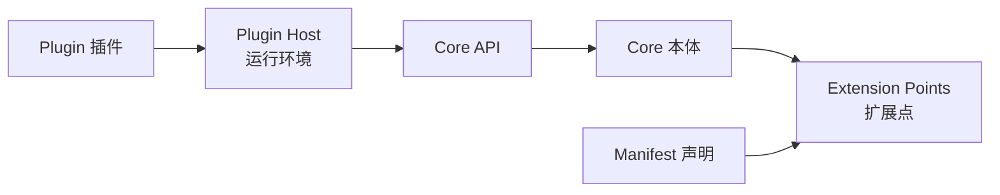
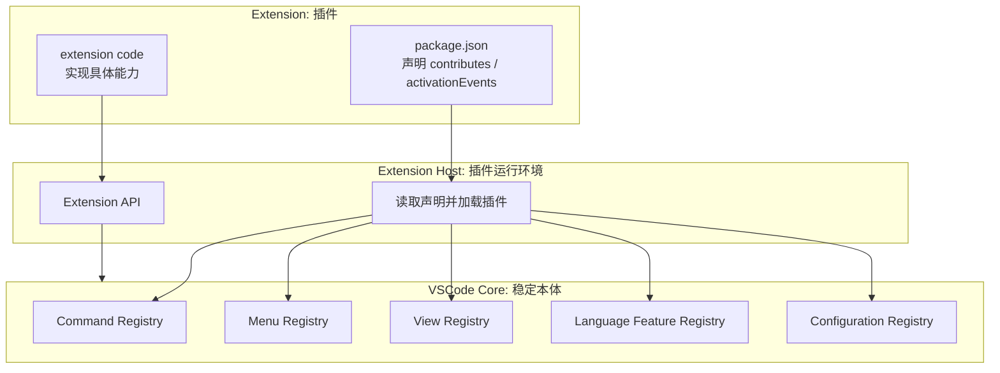
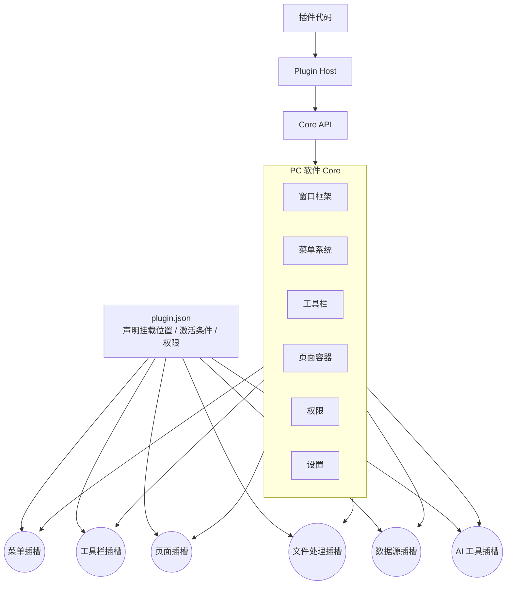
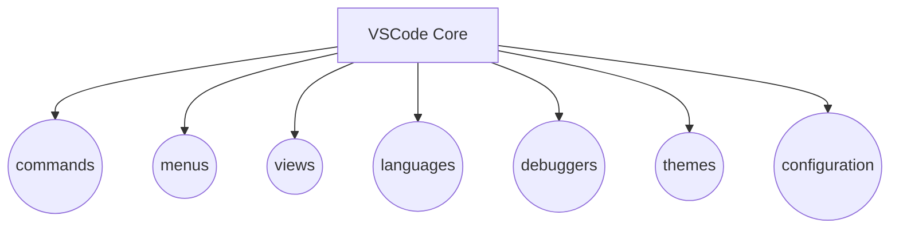
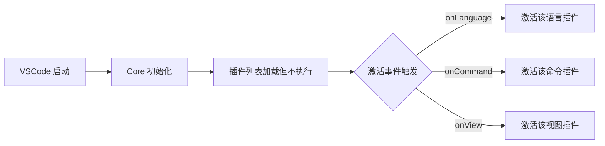
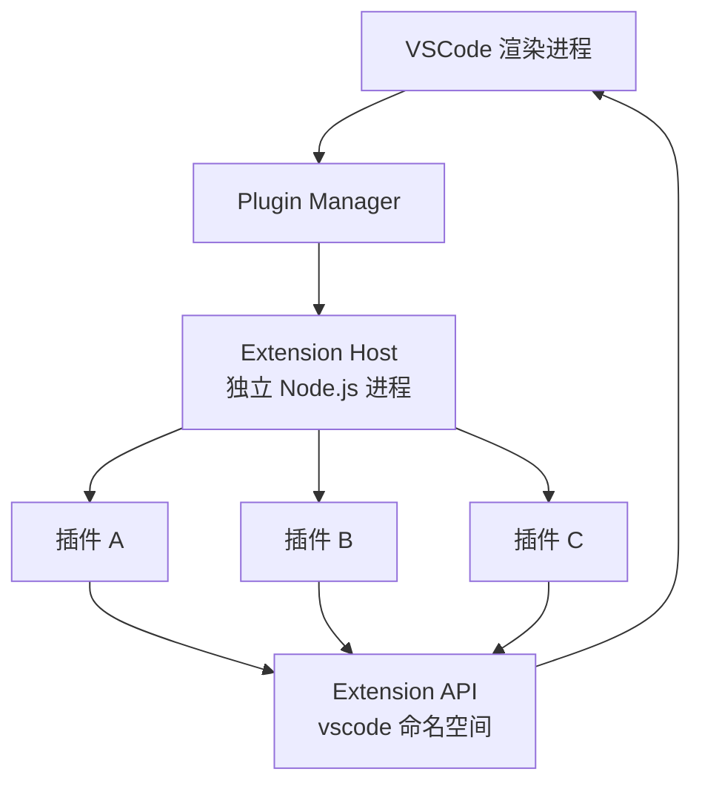
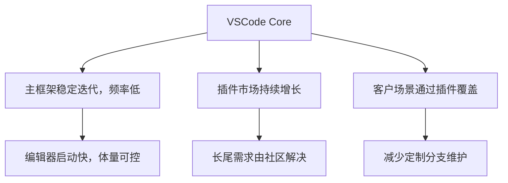

<!-- @format -->

# 从 VSCode 理解 PC 软件如何插件化

> 本文属于 [Mod 化 / 插件化设计总览](think.md) 中的“具体实现”维度，用 VSCode 的结构反推 PC 软件的扩展点、声明、运行宿主和 API 边界。

## 0. 核心观察

VSCode 的架构可以简化为一个公式：

```text
PC 插件化软件 = Core 本体 + Extension Points 扩展点 + Manifest 声明 + Plugin Host 运行环境 + API 边界
```



这套结构在 VSCode 中的具体形态：

| 抽象层 | VSCode 中的实现 |
|--------|----------------|
| Core 本体 | 编辑器主程序（窗口、命令系统、菜单） |
| Extension Points | Contribution Points（命令、菜单、视图、语言服务） |
| Manifest | `package.json` 中的 `contributes` 和 `activationEvents` |
| Plugin Host | Extension Host 进程 |
| Core API | Extension API（`vscode` 命名空间） |

---

## 一、VSCode 解决了哪些插件化的共性问题

PC 软件在扩展能力时通常面临这些问题：

| 问题 | VSCode 的解决方式 |
|------|------------------|
| 功能膨胀导致主程序过重 | Core 只保留基础框架，长尾能力通过插件提供 |
| 扩展点不明确 | Contribution Points 明确定义可扩展位置 |
| 插件接入不可控 | `package.json` 声明能力、入口、激活条件 |
| 插件影响主程序稳定性 | Extension Host 进程隔离插件运行 |
| 插件与主程序耦合 | Extension API 作为唯一调用通道 |

VSCode 的价值在于分层清晰：Core、扩展点、声明、运行环境、API 各负其责。

---

## 二、VSCode 的插件化结构

VSCode 可以简化成五个部分：

| 部分                | 在 VSCode 中的含义                 | 对 PC 软件的抽象 |
| ------------------- | ---------------------------------- | ---------------- |
| Core                | 编辑器主程序                       | PC 软件本体      |
| Contribution Points | 命令、菜单、视图、语言能力等扩展点 | 插槽             |
| `package.json`      | 插件声明文件                       | Manifest         |
| Extension Host      | 插件运行进程                       | 插件运行环境     |
| Extension API       | 插件访问 VSCode 的接口             | Core API         |

```text
VSCode 插件化结构

┌─────────────────────────────────────────────────────┐
│ VSCode Core                                         │
│ 编辑器窗口 / 命令系统 / 菜单 / 视图 / 语言服务       │
│                                                     │
│   ○ commands     ○ menus     ○ views                │
│   ○ languages    ○ debuggers ○ configuration        │
└───────────────┬─────────────────────────────────────┘
                │ Extension API
                │
┌───────────────▼─────────────────────────────────────┐
│ Extension Host                                      │
│ 插件在这里运行，通过 API 调用 Core，不直接改 Core     │
└───────────────┬─────────────────────────────────────┘
                │
┌───────────────▼─────────────────────────────────────┐
│ Extension                                           │
│ package.json 声明 contributes / activationEvents     │
│ extension code 实现具体能力                          │
└─────────────────────────────────────────────────────┘
```



核心逻辑：

1. Core 先定义哪些能力可以扩展。
2. 插件通过 `package.json` 声明自己贡献什么能力。
3. Extension Host 读取声明并加载插件。
4. 插件通过 Extension API 和 Core 交互。

---

## 三、抽象成 PC 软件插件化模型

把 VSCode 的设计抽象出来，PC 软件插件化可以按下面的模型理解。

```text
PC 软件插件化模型

┌──────────────────────────────────────────────┐
│ Core 本体                                    │
│ 窗口 / 菜单 / 工具栏 / 页面容器 / 权限 / 设置 │
│                                              │
│   ○ 菜单插槽   ○ 工具栏插槽   ○ 页面插槽      │
│   ○ 文件插槽   ○ 数据源插槽   ○ AI 工具插槽   │
└───────────────┬──────────────────────────────┘
                │ Core API
                │
┌───────────────▼──────────────────────────────┐
│ Plugin Host                                  │
│ 插件运行、权限校验、生命周期、错误隔离        │
└───────────────┬──────────────────────────────┘
                │
┌───────────────▼──────────────────────────────┐
│ Plugin                                       │
│ plugin.json 声明能力，plugin code 实现能力    │
└──────────────────────────────────────────────┘
```



这套模型的关键是：

- Core 管稳定能力。
- Slots 管扩展边界。
- Manifest 管声明和约束。
- Plugin Host 管运行和隔离。
- API 管插件与主程序的交互。

---

## 四、VSCode 定义的扩展点类型

VSCode 通过 Contribution Points 定义了 20+ 种扩展位置。常见的类型包括：

| 扩展点 | VSCode 中的用途 | 典型场景 |
|--------|----------------|---------|
| `commands` | 注册可执行命令 | 导出、搜索、格式化 |
| `menus` | 向菜单/右键菜单增加入口 | 编辑器右键、资源管理器右键 |
| `views` | 增加侧边栏面板 | 文件树、大纲、调试面板 |
| `languages` | 语言支持（高亮、补全、诊断） | TypeScript、Python 支持 |
| `debuggers` | 调试器接入 | Node.js、Python 调试 |
| `themes` | 主题和图标主题 | 暗色/亮色主题 |
| `configuration` | 配置项定义 | 编辑器设置、插件专属配置 |



扩展点的本质是”主程序定义接口，插件实现能力”。插件无法随意修改 Core，只能在预定义的位置插入功能。

---

## 五、插件声明：VSCode 的 `package.json` 模式

VSCode 插件通过 `package.json` 的特定字段声明自己的能力。以下是关键字段：

| 字段 | 作用 |
|------|------|
| `name` | 插件名称 |
| `version` | 插件版本 |
| `main` | 插件入口文件 |
| `activationEvents` | 激活时机，如 `onLanguage:python`、`onCommand:xxx` |
| `contributes` | 声明在哪些扩展点贡献能力 |
| `engines.vscode` | 兼容的 VSCode 版本 |

示例：

```json
{
  “name”: “csv-viewer”,
  “version”: “1.0.0”,
  “main”: “./index.js”,
  “activationEvents”: [“onLanguage:csv”],
  “contributes”: {
    “commands”: [“csv.openPreview”],
    “menus”: [“editor/context”],
    “views”: [“csv.preview”]
  }
}
```

这种声明式接入的效果：

- 主程序启动时即可了解插件的能力和意图
- 插件不在声明中的操作无法执行
- 兼容性和版本依赖在 `engines.vscode` 中明确
- 插件升级替换时依赖声明保持不变

---

## 六、按需激活：VSCode 的延迟加载机制

VSCode 不会在启动时加载所有插件。它通过 `activationEvents` 控制插件的启动时机：

| 激活事件 | 示例 |
|----------|------|
| `onLanguage:csv` | 打开该语言文件时激活 |
| `onCommand:csv.openPreview` | 执行该命令时激活 |
| `onView:csv.preview` | 侧边栏视图展开时激活 |
| `*` | 始终随主程序启动（不推荐） |



`*` 事件虽然可用，但多数插件使用精确事件来避免影响启动速度。

---

## 七、运行隔离：VSCode 的 Extension Host 机制

VSCode 的插件不直接在编辑器进程内运行，而是放在独立的 Extension Host 进程中：

```text
VSCode 主进程 (Electron 渲染进程)
│
├─ Plugin Manager：安装、启用、禁用、卸载
│
└─ Extension Host (独立 Node.js 进程)
      ├─ 插件 A
      ├─ 插件 B
      └─ 插件 C
```



进程隔离的效果：

- Extension Host 崩溃时编辑器窗口不受影响
- 插件不能直接访问 DOM 和 Node.js API，只能通过 `vscode` 命名空间
- 插件性能问题（CPU 占用等）可以被宿主进程监控和限制
- 启用、禁用插件只需通知 Extension Host 重新加载

---

## 八、VSCode 插件体系的关键模块拆解

VSCode 的插件系统围绕以下几个模块运转：


1. **Core 的界定**
   VSCode 将编辑器核心（窗口、命令、菜单、文件管理）作为不变本体，扩展能力全部外部化。

2. **扩展点的定义**
   Contribution Points 是 VSCode 预定义的接口集合。每个扩展点都有明确的数据格式和生命周期。

3. **Manifest 声明**
   插件通过 `package.json` 声明 `contributes`、`activationEvents`、`engines`。主程序启动时解析所有声明，不立即执行插件代码。

4. **Core API 边界**
   插件只能通过 `vscode` 命名空间与编辑器交互，不能直接访问文件系统、DOM 或内部实现。

5. **Extension Host 进程隔离**
   Extension Host 是独立的 Node.js 进程，负责加载、执行、生命周期管理、错误捕获和卸载。

6. **插件分发**
   VSCode 通过 Marketplace 分发插件，但插件的运行、加载完全由本地 Extension Host 控制，不依赖市场侧逻辑。

---

## 九、产品层面的后果

VSCode 这套插件化设计带来了几个实际后果：



- **主程序更轻**：VSCode 本身只包含编辑器的通用能力，语言支持、工具集成全部插件化。
- **长尾由社区覆盖**：用户需要的各种小众功能（语言支持、工具集成、主题），通过插件市场自行匹配。
- **定制不侵入源码**：企业客户或团队定制通过打包私用插件实现，不需 fork 和修改 VSCode 源码。
- **能力可复用**：同类型产品（VS Code for the Web、GitHub Codespaces）复用同一套插件协议和生态。

---

## 十、总结

VSCode 的插件化可以简化为五个部分：

```text
Core 本体 -> Extension Points 扩展点 -> Manifest 声明 -> Extension Host 进程 -> Extension API 边界
```

| 部分 | VSCode 中的实体 | 作用 |
|------|----------------|------|
| Core | 编辑器主进程 | 稳定基础框架 |
| Extension Points | Contribution Points | 定义可扩展的位置 |
| Manifest | `package.json` | 声明插件能力和激活条件 |
| Extension Host | 独立 Node.js 进程 | 插件运行和隔离 |
| Extension API | `vscode` 命名空间 | 插件与 Core 的交互边界 |

这套架构的核心逻辑是：Core 和插件之间的关系不是”调用和被调用”，而是”框架承载能力”。插件不修改 Core，Core 不假设插件的存在——两者通过扩展点和 API 解耦。
