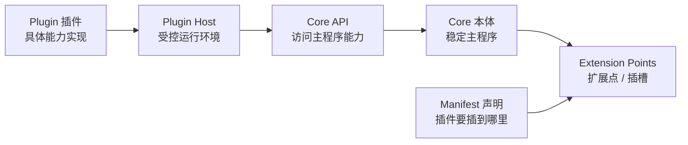
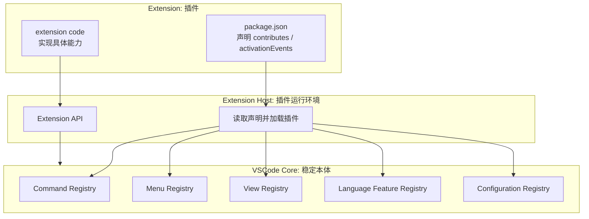
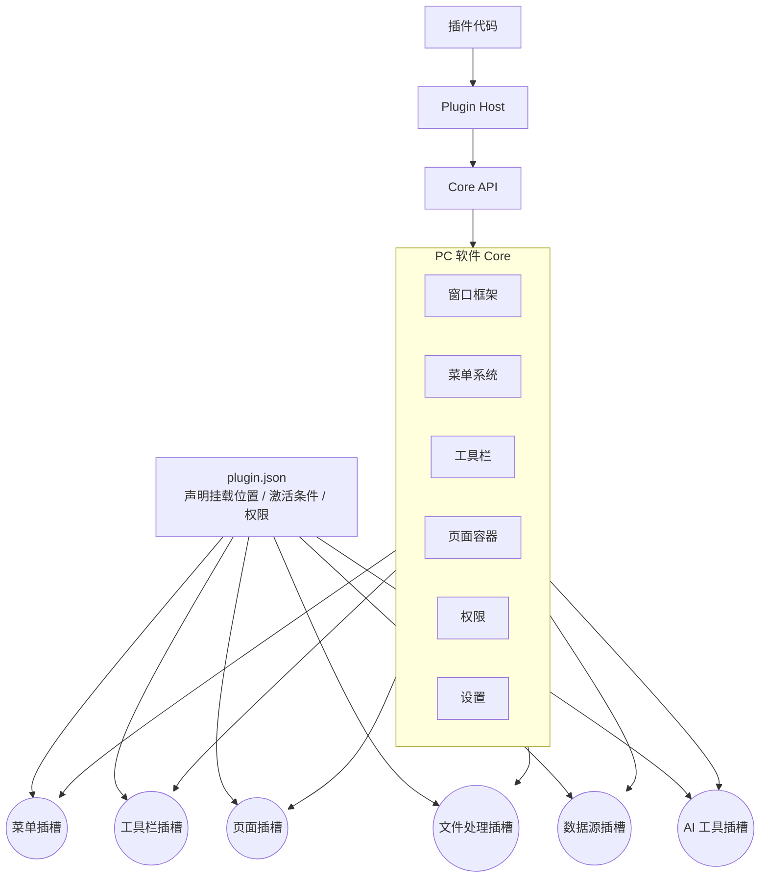
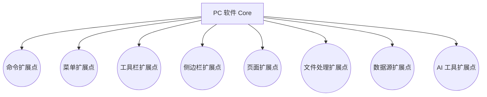
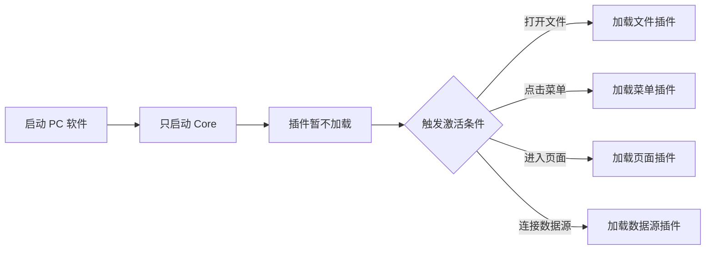
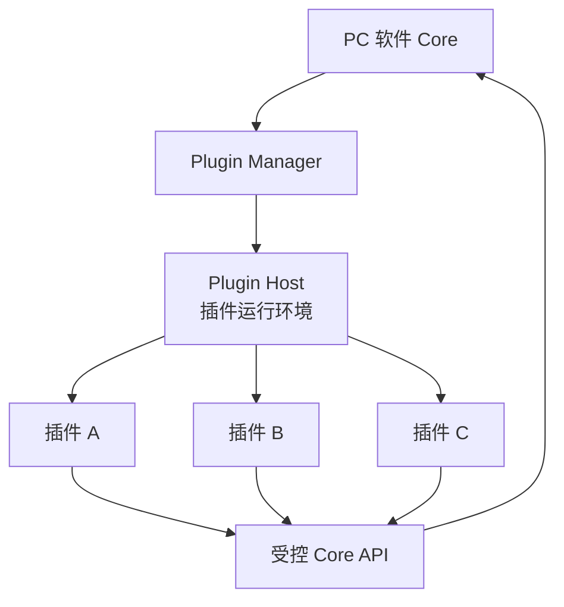
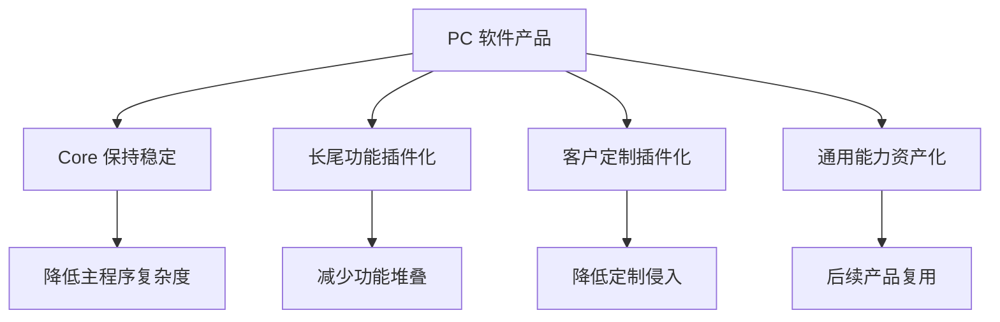

<!-- @format -->

# 从 VSCode 理解 PC 软件如何插件化

## 0. 主题升华

VSCode 不是一个单纯的“插件很多的编辑器”，它更像是一个典型的 PC 软件插件化样板：

> 主程序保持稳定，能力通过扩展点开放；插件通过声明文件接入，在受控运行环境中执行，并通过 API 调用主程序能力。

因此，从 VSCode 了解 PC 软件插件化，重点不是学习“怎么做插件市场”，而是理解一套通用结构：

```text
PC 插件化软件 = Core 本体 + Extension Points 扩展点 + Manifest 声明 + Plugin Host 运行环境 + API 边界
```



这个结构可以迁移到大多数 PC 软件：

- 编辑器类软件。
- 数据分析类软件。
- 办公工具类软件。
- 设计 / 创作类软件。
- 企业桌面客户端。
- AI PC 工具。

---

## 一、为什么用 VSCode 来理解 PC 软件插件化

PC 软件天然会遇到几个问题：

- 功能越做越多，主程序越来越重。
- 用户需求分散，长尾能力不适合全部内置。
- 客户定制容易侵入主程序。
- 软件启动和运行容易被扩展能力拖慢。
- 产品失败后，能力难以复用。

VSCode 的插件化正好回答了这些问题：

| PC 软件问题 | VSCode 的回答 |
| --- | --- |
| 功能太多 | Core 只做稳定主框架，长尾能力插件化 |
| 扩展点混乱 | 用 Contribution Points 明确定义可扩展位置 |
| 插件接入不可控 | 用 `package.json` 声明能力、入口、激活条件 |
| 插件影响主程序 | 用 Extension Host 承载插件运行 |
| 插件和主程序耦合 | 插件通过 Extension API 调用 Core |

所以，VSCode 的价值不是“插件数量多”，而是它把 PC 软件拆成了清晰的几层。

---

## 二、VSCode 的插件化结构

VSCode 可以简化成五个部分：

| 部分 | 在 VSCode 中的含义 | 对 PC 软件的抽象 |
| --- | --- | --- |
| Core | 编辑器主程序 | PC 软件本体 |
| Contribution Points | 命令、菜单、视图、语言能力等扩展点 | 插槽 |
| `package.json` | 插件声明文件 | Manifest |
| Extension Host | 插件运行进程 | 插件运行环境 |
| Extension API | 插件访问 VSCode 的接口 | Core API |

```text
VSCode 插件化结构

┌─────────────────────────────────────────────────────┐
│ VSCode Core                                         │
│ 编辑器窗口 / 命令系统 / 菜单 / 视图 / 语言服务       │
│                                                     │
│   ○ commands     ○ menus     ○ views                │
│   ○ languages    ○ debuggers ○ configuration        │
└───────────────┬─────────────────────────────────────┘
                │ Extension API
                │
┌───────────────▼─────────────────────────────────────┐
│ Extension Host                                      │
│ 插件在这里运行，通过 API 调用 Core，不直接改 Core     │
└───────────────┬─────────────────────────────────────┘
                │
┌───────────────▼─────────────────────────────────────┐
│ Extension                                           │
│ package.json 声明 contributes / activationEvents     │
│ extension code 实现具体能力                          │
└─────────────────────────────────────────────────────┘
```



核心逻辑：

1. Core 先定义哪些能力可以扩展。
2. 插件通过 `package.json` 声明自己贡献什么能力。
3. Extension Host 读取声明并加载插件。
4. 插件通过 Extension API 和 Core 交互。

---

## 三、抽象成 PC 软件插件化模型

把 VSCode 的设计抽象出来，PC 软件插件化可以按下面的模型理解。

```text
PC 软件插件化模型

┌──────────────────────────────────────────────┐
│ Core 本体                                    │
│ 窗口 / 菜单 / 工具栏 / 页面容器 / 权限 / 设置 │
│                                              │
│   ○ 菜单插槽   ○ 工具栏插槽   ○ 页面插槽      │
│   ○ 文件插槽   ○ 数据源插槽   ○ AI 工具插槽   │
└───────────────┬──────────────────────────────┘
                │ Core API
                │
┌───────────────▼──────────────────────────────┐
│ Plugin Host                                  │
│ 插件运行、权限校验、生命周期、错误隔离        │
└───────────────┬──────────────────────────────┘
                │
┌───────────────▼──────────────────────────────┐
│ Plugin                                       │
│ plugin.json 声明能力，plugin code 实现能力    │
└──────────────────────────────────────────────┘
```



这套模型的关键是：

- Core 管稳定能力。
- Slots 管扩展边界。
- Manifest 管声明和约束。
- Plugin Host 管运行和隔离。
- API 管插件与主程序的交互。

---

## 四、PC 软件应该优先设计哪些扩展点

插件化不是“允许别人随便写代码”，而是主程序先定义哪些地方可以被扩展。

PC 软件可以优先设计这些扩展点：

| 扩展点 | 说明 | 示例 |
| --- | --- | --- |
| 命令扩展点 | 插件注册一个可执行命令 | 导出、搜索、分析、同步 |
| 菜单扩展点 | 插件向菜单增加入口 | 文件菜单、工具菜单、右键菜单 |
| 工具栏扩展点 | 插件增加按钮或工具组 | 运行、格式化、上传、AI 分析 |
| 侧边栏扩展点 | 插件增加侧边面板 | 文件树、任务面板、AI 面板 |
| 页面扩展点 | 插件提供完整页面 | 设置页、看板页、编辑页 |
| 文件处理扩展点 | 插件处理特定文件类型 | CSV、PDF、Markdown、图片 |
| 数据源扩展点 | 插件连接外部数据 | 数据库、API、第三方 SaaS |
| AI 工具扩展点 | 插件提供 AI 能力 | Skill、MCP、Agent 工具 |



扩展点设计得越清楚，插件越不需要侵入主程序。

---

## 五、插件声明：让插件接入变得可控

VSCode 插件通过 `package.json` 声明自己的能力。PC 软件也应该设计类似的 `plugin.json`。

插件声明至少应该包含：

| 字段 | 说明 |
| --- | --- |
| `name` | 插件名称 |
| `version` | 插件版本 |
| `main` | 插件入口 |
| `activationEvents` | 插件何时激活 |
| `contributes` | 插件贡献哪些命令、菜单、页面、文件处理器 |
| `permissions` | 插件需要哪些权限 |
| `dependencies` | 插件依赖哪些能力或版本 |

示意：

```json
{
  "name": "csv-viewer",
  "version": "1.0.0",
  "main": "./index.js",
  "activationEvents": ["onFile:csv"],
  "contributes": {
    "commands": ["csv.openPreview"],
    "menus": ["file.context"],
    "views": ["csv.preview"]
  },
  "permissions": ["file.read"]
}
```

插件声明的意义：

- 主程序可以提前知道插件要做什么。
- 插件可以按需激活。
- 权限可以在运行前检查。
- 插件升级和兼容可以被管理。

---

## 六、按需激活：避免 PC 软件被插件拖慢

PC 软件最容易遇到的问题是插件过多导致启动慢。VSCode 的启发是：插件不应该全部随主程序启动。

```text
不推荐：
启动 PC 软件 -> 加载全部插件 -> 初始化全部功能 -> 启动变慢

推荐：
启动 PC 软件 -> 只启动 Core -> 满足条件时再激活插件
```

常见激活条件：

| 激活条件 | 示例 |
| --- | --- |
| 打开某类文件 | 打开 `.csv` 时激活表格插件 |
| 点击某个菜单 | 点击“导出 PDF”时激活导出插件 |
| 进入某个页面 | 进入数据看板时激活图表插件 |
| 调用某个命令 | 执行搜索命令时激活检索插件 |
| 连接某个数据源 | 连接数据库时激活数据源插件 |



---

## 七、运行隔离：保护主程序稳定性

VSCode 使用 Extension Host 承载插件运行。PC 软件也应该考虑类似的隔离层。

```text
Core 主程序
│
├─ Plugin Manager：安装、启用、禁用、卸载
│
└─ Plugin Host：运行插件、隔离错误、限制权限
      ├─ 插件 A
      ├─ 插件 B
      └─ 插件 C
```



隔离带来的价值：

- 插件崩溃时，尽量不拖垮主程序。
- 插件权限可以被限制。
- 插件性能可以被监控。
- 插件启用、禁用、卸载更清晰。
- 插件和 Core 的边界更稳定。

---

## 八、从 VSCode 反推 PC 插件化落地步骤

PC 软件如果要开始插件化，可以按下面顺序推进：


具体步骤：

1. **识别 Core**
   明确哪些能力必须稳定在主程序里，例如窗口、菜单、设置、权限、生命周期。

2. **定义扩展点**
   先开放少量高价值插槽，例如菜单、工具栏、页面、文件处理、数据源。

3. **设计插件声明**
   让插件通过 `plugin.json` 声明挂载位置、激活条件、权限和入口。

4. **设计 Core API**
   插件只能通过 API 调用主程序能力，不能直接访问内部实现。

5. **实现 Plugin Host**
   负责加载、运行、隔离、禁用、卸载插件。

6. **做 PoC**
   先用 1-2 个插件验证，例如 CSV 预览插件、AI 工具插件、数据源插件。

---

## 九、产品战略层面的意义

从 VSCode 看 PC 软件插件化，最终不是为了“技术上更酷”，而是为了产品可持续演进。



它带来的收益是：

- 主程序更轻，避免功能不断堆叠。
- 高频能力进入 Core，长尾能力通过插件补充。
- 客户定制通过插件交付，减少修改主程序。
- 不同产品可以复用同一批插件。
- 产品失败后，插件能力仍然可以沉淀。

---

## 十、阶段性结论

从 VSCode 理解 PC 软件插件化，可以得出一个通用结论：

> PC 软件插件化的本质，是把主程序从“功能堆叠体”变成“能力承载框架”。  
> Core 负责稳定框架，扩展点定义接入位置，Manifest 声明插件能力，Plugin Host 负责受控运行，Core API 负责边界交互。

因此，PC 软件要插件化，优先讨论的不是插件市场，而是五件事：

1. Core 保留哪些稳定能力。
2. 先开放哪些扩展点。
3. 插件如何声明、加载、激活。
4. 插件如何隔离运行。
5. 哪些能力值得沉淀为插件资产。
