<!-- @format -->

# 关于软件产品的 Mod 化 / 插件化

## 0. 方向结论

这份初稿重点讨论**方向**，不是马上建设完整插件平台。

> 所有软件产品在产品战略和架构设计时，都应朝“本体框架化、能力模组化、接入插槽化、资产可复用化”的方向思考。

```text
所有产品  ──>  识别本体  ──>  识别插槽  ──>  沉淀模组体  ──>  后续产品复用
```

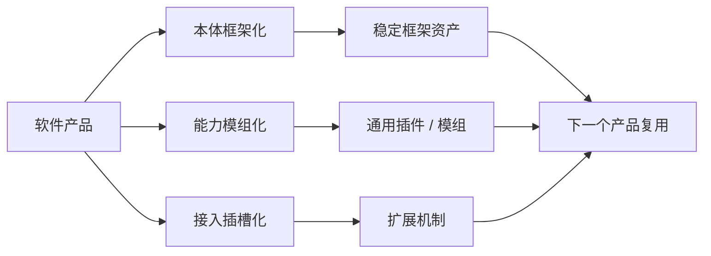

---

## 一、方向上

### 1.1 总方向：从“单产品交付”转向“能力资产沉淀”

Mod 化 / 插件化的价值，不是让所有产品都变复杂，而是让产品试错过程中产生的稳定能力可以留下。

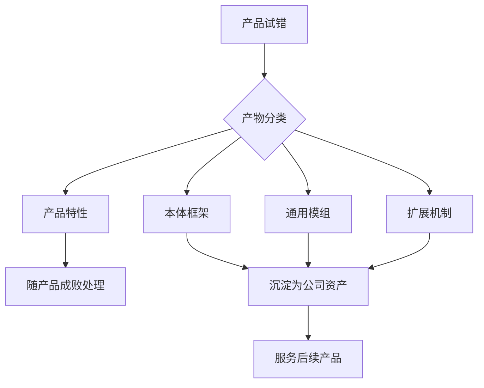

因此，方向讨论先聚焦三件事：

| 问题         | 说明                                |
| ------------ | ----------------------------------- |
| 本体是什么   | 哪些能力应该稳定在产品框架里        |
| 插槽在哪里   | 哪些位置允许外部能力接入            |
| 模组体是什么 | 哪些能力可以作为通用插件 / 模组沉淀 |

### 1.2 统一结构：产品 = 本体 + 插槽 + 模组体

无论 AI 产品还是 ToC 产品，都可以先用这个结构思考：

```text
产品本体 Core
│
├─ 稳定能力：通信 / UI / 运行时 / 权限 / 生命周期
│
├─ 扩展插槽：页面插槽 / 工具插槽 / 数据插槽 / 业务插槽
│
└─ 模组体：页面模组 / 工具模组 / 数据模组 / 业务模组
```

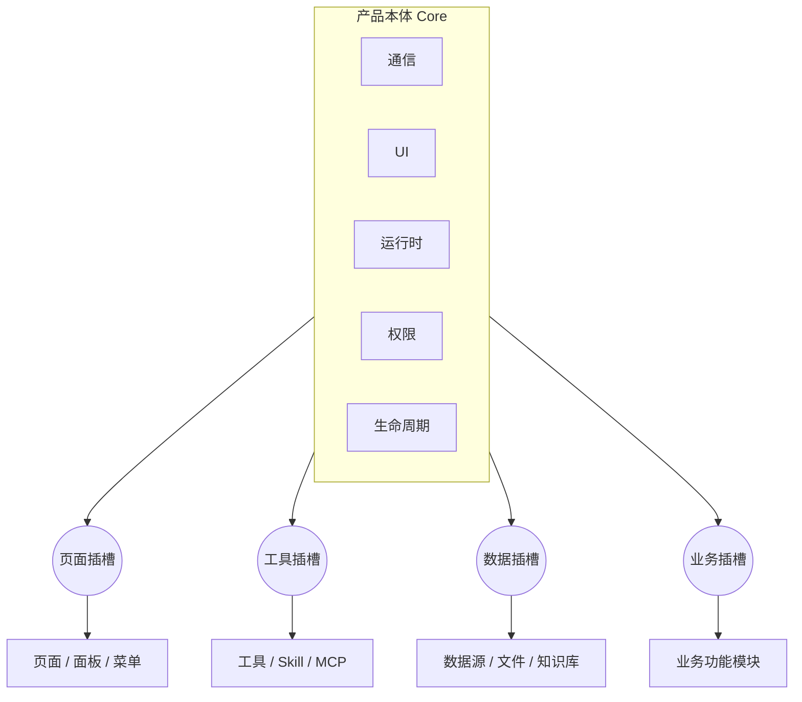

方向判断：

- 本体越稳定，后续产品启动越快。
- 插槽越清晰，后续扩展越少侵入。
- 模组体越可复用，产品失败后的损失越小。

### 1.3 AI 化产品方向

AI 化产品的方向可以先这样理解：

> Agent = Harness + 模型

其中，**Agent Harness / Runtime 是本体方向**，负责承载模型、上下文、工具调用、权限、安全、日志等能力。

而可沉淀的**模组体**包括：

- Agent 配置。
- Skills。
- MCP Server。
- Tools。
- Prompt 包。
- 知识源 / Memory。
- 业务 API 连接器。

```text
AI 产品方向

┌──────────────────────────────────────────────┐
│ 本体：Agent Harness / Runtime                │
│                                              │
│ 模型调用  上下文  工具编排  权限  日志        │
│                                              │
│   ○ Skill 插槽   ○ MCP 插槽   ○ Tool 插槽     │
└──────┼──────────────┼────────────┼───────────┘
       │              │            │
  ┌────▼────┐   ┌─────▼─────┐  ┌───▼────┐
  │总结/检索│   │文件/数据库│  │业务 API│
  │写作/分析│   │浏览器/Git │  │任务执行│
  └─────────┘   └───────────┘  └────────┘
```

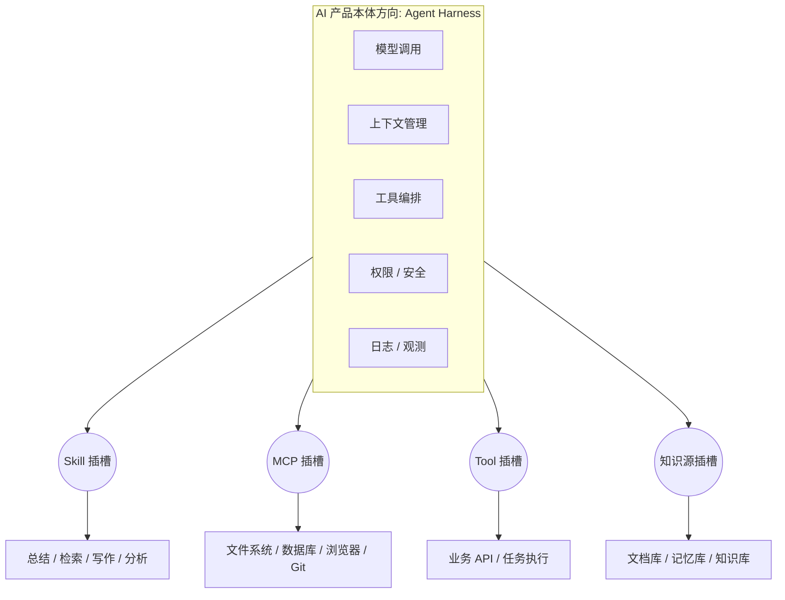

AI 产品的方向重点：

| 方向          | 说明                                       |
| ------------- | ------------------------------------------ |
| Harness 统一  | 不同 AI 产品尽量复用一套运行框架           |
| Skill 模组化  | 写作、检索、总结、分析等能力沉淀为 Skill   |
| MCP 标准化    | 外部工具和数据源尽量通过标准连接方式接入   |
| Tool 可复用   | 业务 API、任务执行、数据查询沉淀为工具模组 |
| Prompt 资产化 | 角色、流程、场景提示词可以复用             |

AI 产品失败后，真正应该留下的是这些能力：

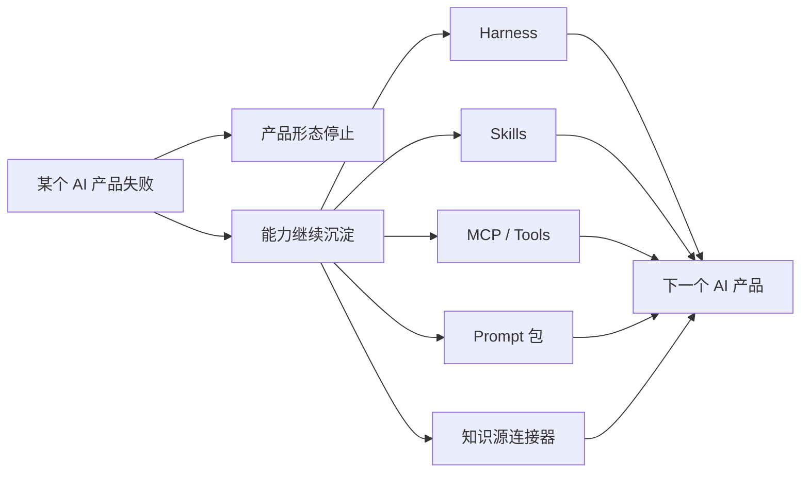

### 1.4 ToC / 常规软件产品方向

ToC / 常规软件产品的方向是：

> 本体沉淀基础框架，模组体沉淀可复用功能。

本体通常包括：

- 通信。
- UI。
- 路由。
- 状态管理。
- 账号 / 权限。
- 发布更新。

模组体通常包括：

- 编辑器。
- 图表 / 看板。
- 文件上传、预览、解析、导出。
- 通知 / 消息。
- 数据源连接。
- 业务功能模块。

```text
ToC / 常规产品方向

┌──────────────────────────────────────────────┐
│ 本体：基础框架                               │
│                                              │
│ UI 框架  路由  通信  状态管理  账号权限       │
│                                              │
│   ○ 页面插槽   ○ 菜单插槽   ○ 工具栏插槽      │
└──────┼───────────┼────────────┼──────────────┘
       │           │            │
  ┌────▼────┐ ┌────▼────┐  ┌────▼────┐
  │编辑器   │ │图表/看板 │  │文件/通知│
  └─────────┘ └─────────┘  └─────────┘
```

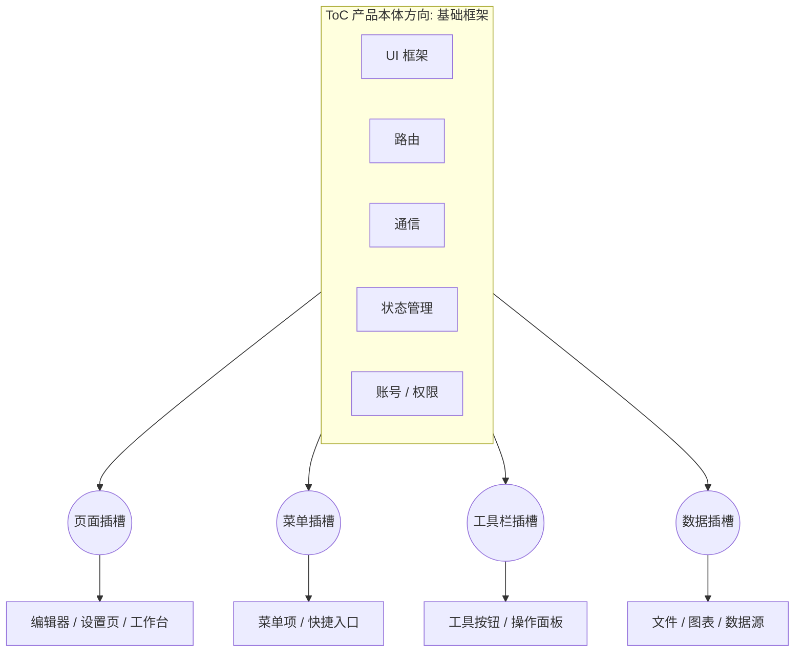

ToC / 常规产品的方向重点：

| 方向         | 说明                                      |
| ------------ | ----------------------------------------- |
| 基础框架统一 | 通信、UI、路由、状态管理尽量复用          |
| UI 插槽化    | 页面、菜单、工具栏、侧边栏可以开放扩展点  |
| 功能模组化   | 编辑器、文件、图表、通知等沉淀为通用模组  |
| 数据连接复用 | API、数据库、第三方系统连接器可跨产品复用 |

---

## 二、案例学习：用于验证方向

案例学习不是主线，只用于验证上面的方向是否合理：

- VSCode 说明：客户端可以通过插槽承载插件能力。
- Java SPI 说明：服务端可以通过接口和声明发现外部实现。

### 2.1 VSCode：客户端方向参考

VSCode 的方向价值是：

> Core 稳定，插件通过 Extension API 和 Contribution Points 插入能力。

```text
VSCode 方向参考

VSCode Core
  ├─ Extension API
  ├─ Commands 插槽
  ├─ Menus 插槽
  ├─ Views 插槽
  └─ Language Features 插槽

Extension
  ├─ package.json 声明插到哪里
  └─ extension code 实现具体能力
```

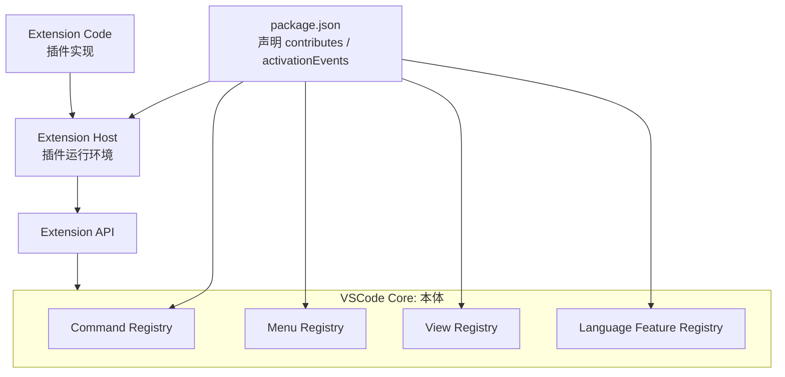

对我们方向上的启发：

- 客户端要先定义扩展插槽。
- 插件要通过声明文件接入。
- 插件通过 API 调用本体能力，而不是直接修改本体。

### 2.2 Java SPI：服务端方向参考

Java SPI 的方向价值是：

> 框架只依赖接口，实现由外部提供，并通过声明文件被运行时发现。

```text
Java SPI 方向参考

框架 / 本体
  └─ 接口 PaymentProvider
       ▲
       │
外部实现包
  ├─ META-INF/services/PaymentProvider
  ├─ AliPayProvider
  └─ WechatPayProvider
```

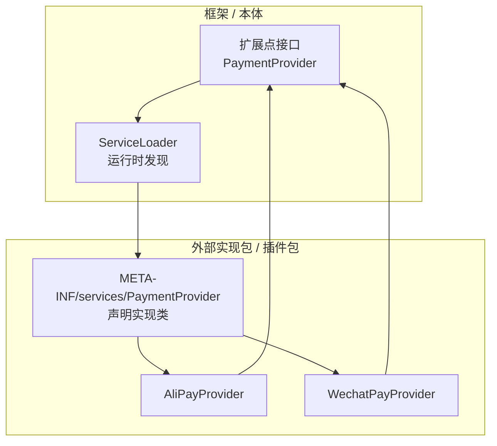

对我们方向上的启发：

- 服务端要先定义接口，也就是服务端插槽。
- 外部实现要通过声明被发现。
- 框架不应该硬编码具体实现类。

---

## 三、挑战：方向落地时绕不开的问题

挑战部分也只围绕方向展开，不展开成完整治理方案。

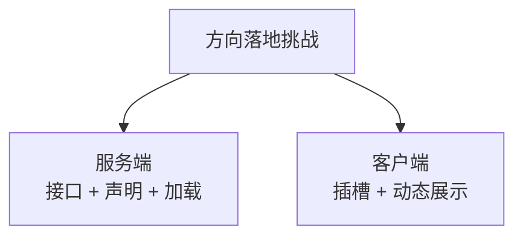

### 3.1 服务端挑战

服务端方向是：

> 从“硬编码实现类”走向“接口 + 声明 + 加载”。

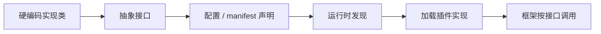

必须先明确：

| 问题 | 说明                       |
| ---- | -------------------------- |
| 接口 | 哪些能力可以作为扩展点     |
| 声明 | 插件如何告诉框架自己存在   |
| 加载 | 启动时加载，还是运行时加载 |
| 约束 | 权限、安全、版本如何控制   |

### 3.2 客户端挑战

客户端方向是：

> 从“固定 UI”走向“插槽式 UI”，让页面、菜单、工具栏、侧边栏具备动态扩展能力。

```text
客户端插槽式 UI

┌──────────────────────────────────────────────┐
│ 顶部菜单              [菜单插槽]              │
├──────────────┬───────────────────────────────┤
│ 侧边栏插槽    │ 页面区域 [页面插槽]            │
│              │                               │
│              │ 工具栏 [工具插槽]              │
└──────────────┴───────────────────────────────┘
```

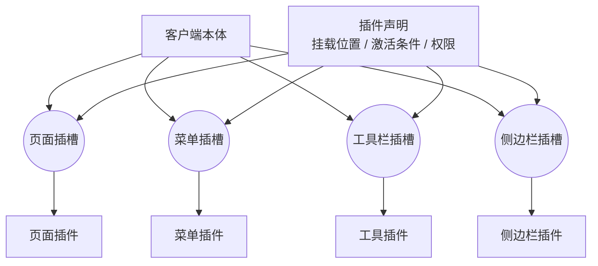

必须先明确：

| 问题           | 说明                                |
| -------------- | ----------------------------------- |
| 插在哪里       | 页面、菜单、工具栏、侧边栏、设置页  |
| 何时出现       | 启动即展示，还是满足条件再展示      |
| 谁能使用       | 权限、套餐、角色、场景限制          |
| 是否影响主应用 | UI 一致性、状态隔离、样式隔离、性能 |

---

## 四、继续讨论需要补充的信息

如果要继续推进，建议不是直接讨论“做不做插件平台”，而是先让每类产品补齐三张图：

1. 本体图。
2. 插槽图。
3. 第一批模组体图。

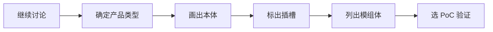

最少需要补充：

| 信息     | 要回答的问题                      |
| -------- | --------------------------------- |
| 产品类型 | 先看 AI 产品，还是 ToC / 常规产品 |
| 本体     | 哪些能力必须稳定在框架里          |
| 插槽     | 哪些位置允许外部能力接入          |
| 模组体   | 第一批值得沉淀的通用插件是什么    |
| PoC      | 先用哪个产品验证插槽和加载机制    |

---

## 五、阶段性结论

这份初稿要突出的方向是：

> 软件产品不要只按“当前产品功能”组织，而要按“本体 + 插槽 + 模组体”组织。
> 本体沉淀框架，插槽定义扩展方式，模组体沉淀可复用能力。

因此，当前讨论重点应该放在：

1. AI 产品如何沉淀 Agent Harness、Skills、MCP、Tools。
2. ToC / 常规产品如何沉淀基础框架、UI 插槽、可复用功能模块。
3. 服务端如何通过接口和声明接入外部实现。
4. 客户端如何通过插槽和动态插桩接入 UI 模组。
