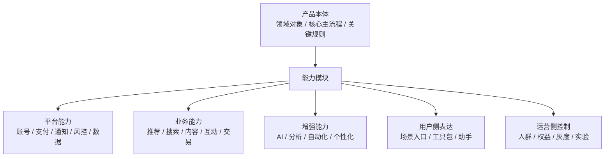
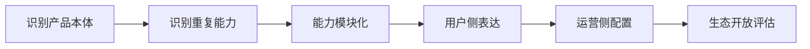

<!-- @format -->

# 从 ToC 产品看 Mod 化 / 插件化设计

> 本文属于 [Mod 化 / 插件化设计总览](think.md) 中的“产品方向”维度，用来说明 ToC 产品如何在不暴露复杂插件体系的前提下，把稳定的产品本体和可复用的能力模块区分开，让产品可以持续演进。

## 0. 核心判断

ToC 产品谈 Mod 化 / 插件化，不应该先从“插件市场”切入，也不应该让普通用户理解“模块、插件、插槽、配置”这些内部概念。

更合理的方向是：

> 先识别产品本体，也就是这个产品赖以成立的稳定领域对象、核心主流程和关键规则；再把可复用、可替换、可组合的功能沉淀成能力模块。场景包只是用户侧的表达方式，运营配置只是能力开放规则，它们都不是核心架构的主线。

可以抽象为：

```text
ToC 产品 = 产品本体 + 能力模块

产品本体：定义产品是什么、围绕什么对象运转、主流程是什么
能力模块：定义产品可以复用哪些能力来增强、运营和扩展本体
```



这个方向的关键不是“让用户安装插件”，而是让产品内部的能力可以沉淀、复用和组合，同时对用户保持简单体验。

---

## 一、为什么不是插件市场或功能堆叠

ToC 产品发展到一定阶段，通常会遇到这些问题：

| 问题         | 表现                                                          |
| ------------ | ------------------------------------------------------------- |
| 功能堆叠     | 新需求不断塞进主流程，首页、菜单、路径越来越重                |
| 场景分散     | 用户需求很多，但不是每个能力都适合做成主功能                  |
| 增长实验频繁 | 会员、权益、增值包、活动难以灵活组合                          |
| 增长策略验证 | 为了提升转化、留存、活跃、付费，经常要做 AB、灰度、小流量验证 |
| 能力复用困难 | 一个产品方向失败后，推荐、内容、风控、AI 等能力难以沉淀       |

这里的“增长策略验证”不是说产品每天都要乱改，而是指 ToC 产品经常需要验证：

- 不同入口文案是否提升点击率。
- 不同推荐策略是否提升留存。
- 不同会员权益是否提升付费。
- 不同活动玩法是否提升转化。
- 新能力是否先给小部分用户试用，再决定是否放量。

如果所有变化都直接写进主流程，产品会变成这样：

```text
新需求 -> 新入口 -> 新页面 -> 新开关 -> 新运营规则 -> 主产品越来越重
```

更合理的方式是：

```text
新需求 -> 判断是否改变产品本体
       -> 本体能力谨慎演进
       -> 可复用能力沉淀为模块
       -> 用户侧按任务组织入口
       -> 运营侧按规则控制开放
```

---

## 二、本体和能力模块怎么区分

产品本体和能力模块不是按“重要 / 不重要”来区分，也不是按“前端 / 后端”来区分，而是按它们在产品里的职责来区分。

| 维度       | 产品本体                       | 能力模块                             |
| ---------- | ------------------------------ | ------------------------------------ |
| 回答的问题 | 这个产品是什么                 | 这个产品可以复用什么能力             |
| 关注对象   | 领域对象、主流程、状态规则     | 可复用的工具、策略、服务、增强能力   |
| 变化频率   | 应该相对稳定                   | 可以更快迭代                         |
| 影响范围   | 改动会影响产品主体验和核心路径 | 改动通常影响某个能力、入口或人群     |
| 复用方式   | 为本产品提供稳定骨架           | 可以跨入口、跨场景、跨产品复用       |
| 用户感知   | 用户每天都在使用但不一定意识到 | 用户可能感知为工具、助手、权益、服务 |

更具体地说：

```text
产品本体 = 领域对象 + 核心主流程 + 关键状态规则
能力模块 = 平台能力 + 业务能力 + 增强能力
```

### 2.1 产品本体

产品本体定义一个 ToC 产品赖以成立的东西。

它通常包括：

| 本体组成   | 说明                     | 示例                                                   |
| ---------- | ------------------------ | ------------------------------------------------------ |
| 领域对象   | 产品围绕哪些核心对象运转 | 用户、内容、商品、订单、关系、邮件、任务               |
| 核心主流程 | 用户最主要的路径是什么   | 浏览内容、发布内容、匹配沟通、下单支付、收发邮件       |
| 状态规则   | 对象和流程有哪些稳定状态 | 已发布 / 草稿 / 删除，待支付 / 已支付，已关注 / 已拉黑 |
| 基础约束   | 哪些规则必须长期稳定     | 权限、隐私、安全、合规、核心体验边界                   |

判断一个东西是不是产品本体，可以问：

1. 没有它，产品是否还成立。
2. 改它是否会影响大多数用户的主流程。
3. 它是否定义了产品的核心对象、核心路径或核心状态。
4. 它是否应该稳定演进，而不是频繁按活动或人群变化。

### 2.2 能力模块

能力模块是围绕产品本体沉淀出来的可复用能力。

它通常包括三类：

| 能力类型 | 说明                               | 示例                                         |
| -------- | ---------------------------------- | -------------------------------------------- |
| 平台能力 | 支撑产品运行的基础能力             | 账号、支付、通知、风控、数据埋点、配置、实验 |
| 业务能力 | 直接作用于业务对象和主流程的能力   | 推荐、搜索、内容处理、互动、交易、审核       |
| 增强能力 | 增强效率、体验、增长或商业化的能力 | AI 创作、智能总结、增长分析、个性化、自动化  |

支付与会员、消息与通知、安全与风控、数据与埋点当然也可以抽象为能力。它们更适合归为“平台能力”，而不是直接塞进产品本体。

区别在于：

- 当它们定义产品主流程时，它们是本体的一部分。
- 当它们作为可复用支撑能力被多个场景调用时，它们是能力模块。

例如：

| 能力 | 作为本体时               | 作为能力模块时                         |
| ---- | ------------------------ | -------------------------------------- |
| 支付 | 电商产品的下单支付主链路 | 多个产品共用的支付、订单、会员权益能力 |
| 消息 | IM 产品的会话主链路      | 给内容、交易、活动提供通知触达能力     |
| 风控 | 安全产品的核心识别流程   | 给账号、内容、交易提供风险识别能力     |
| 数据 | 数据分析产品的核心对象   | 给增长、实验、推荐提供埋点和指标能力   |

所以，本体和能力模块不是绝对分类，而是看它在当前产品里承担什么职责。

---

## 三、ToC 产品的通用能力抽象

不限定某一个产品，ToC 产品常见能力可以抽象成下面几类。

| 能力模块         | 解决的问题                           | 常见产品形态                       |
| ---------------- | ------------------------------------ | ---------------------------------- |
| 账号与身份能力   | 用户是谁，是否可信，是否有权限       | 社交、内容、电商、工具、邮箱       |
| 内容能力         | 内容如何生产、处理、展示、审核       | 内容社区、社交媒体、邮箱、学习产品 |
| 推荐与搜索能力   | 用户如何找到合适内容、商品、人或信息 | 社交、电商、内容、招聘、婚恋       |
| 互动能力         | 用户之间如何沟通、反馈、协作         | 社交、社区、办公、内容产品         |
| 交易与商业化能力 | 如何收费、支付、权益、广告、分成     | 电商、会员产品、创作者平台         |
| 风控与治理能力   | 如何识别风险、保护用户、控制质量     | 社交、电商、金融、内容社区         |
| 数据与实验能力   | 如何衡量效果、验证策略、支持增长     | 所有增长型 ToC 产品                |
| AI 增强能力      | 如何降低用户操作成本或提升产出质量   | 创作、效率、社交、内容、电商       |

这些能力不一定都要一次性建设，也不一定都要做成独立插件。更现实的做法是：

1. 先识别哪些能力已经在多个入口重复出现。
2. 再判断哪些能力变化快、复用价值高、适合模块化。
3. 最后逐步沉淀接口、权限、配置、指标和治理机制。

---

## 四、未来需要关注：场景包和运营配置

场景包和运营配置不是当前核心判断里的主线，但它们是后续做 ToC 能力模块化时需要关注的方向。这里先简单说明它们的作用，避免把能力模块直接等同于用户看到的入口或运营规则。

### 4.1 场景包

场景包不是技术包，也不是插件安装包，而是用户侧的产品表达：

> 把多个能力模块围绕一个用户任务组合成一个用户能理解的入口或服务。

例如：

| 用户任务         | 可能组合的能力                            | 用户侧表达     |
| ---------------- | ----------------------------------------- | -------------- |
| 更快完成内容发布 | AI 创作、素材处理、标签推荐、发布时间推荐 | 创作者工具包   |
| 更安全地使用产品 | 风控识别、异常提醒、举报辅助、账号保护    | 安全保护服务   |
| 更快处理信息     | 分类、摘要、搜索、待办提取、提醒          | 信息整理助手   |
| 获得更合适推荐   | 用户画像、推荐策略、筛选规则、反馈学习    | 高质量推荐服务 |
| 更好做商业化     | 数据分析、权益、广告、商品挂载、转化分析  | 运营增长工具   |

场景包不一定是固定形态，也不一定必须先于运营配置存在。它只是让用户更容易理解能力组合的一种方式。

### 4.2 运营配置

运营配置不是商业化能力本身，也不是简单开关。

> 运营配置是控制某个能力或场景入口如何开放的一组规则。

它和商业化能力有关，但不是同一个东西：

| 类型       | 解决的问题                                 | 示例                               |
| ---------- | ------------------------------------------ | ---------------------------------- |
| 商业化能力 | 产品能不能收费、卖什么、怎么结算           | 会员、订单、支付、广告、创作者收益 |
| 运营配置   | 某个能力给谁用、用多少、何时开放、如何实验 | 人群、额度、价格、灰度、AB、活动   |

所以运营配置和商业化能力有关联，但运营配置不只服务商业化，也服务灰度、实验、地区差异、活动和降级。

---

## 五、通用落地路径

ToC 产品做 Mod 化 / 插件化，不建议一开始开放插件市场。更合理的是分阶段推进。



### 5.1 识别产品本体

- 明确产品围绕哪些领域对象运转。
- 明确用户最核心的主流程。
- 明确哪些状态、权限、安全、隐私规则必须稳定。

### 5.2 识别重复能力

- 找出多个页面、入口、活动中重复出现的能力。
- 找出变化频繁但不应该污染主流程的能力。
- 找出未来可能跨产品复用的能力。

### 5.3 能力模块化

- 为能力定义输入、输出、权限和效果指标。
- 将平台能力、业务能力、增强能力分层治理。
- 优先沉淀高频、复用价值高、边界清晰的能力。

### 5.4 用户侧表达

- 不把模块名直接暴露给用户。
- 按用户任务组织入口或工具。
- 场景包、助手、工具包都只是表达方式，不是必须建设成固定系统。

### 5.5 运营侧配置

- 根据需要支持人群、权益、价格、灰度、实验、活动等配置。
- 配置服务于能力开放，不是所有能力都必须先做复杂配置。
- 配置必须支持兜底和回滚，避免影响主流程。

### 5.6 生态开放评估

只有当用户规模、场景复杂度、审核机制、权限体系成熟后，再考虑开放外部生态。

---

## 六、阶段性结论

ToC 产品的 Mod 化 / 插件化，核心不是场景包，也不是运营配置，更不是插件市场。

更准确的表达是：

> 产品本体负责定义产品是什么，包括领域对象、核心主流程和关键规则；能力模块负责沉淀产品可复用的能力，包括平台能力、业务能力和增强能力；用户侧可以按场景包装能力，运营侧可以按规则控制能力开放。

最终，用户不需要理解“插件化”，只需要感受到：

1. 产品更轻。
2. 主流程更稳定。
3. 能力更丰富。
4. 服务更个性化。
5. 体验持续变好。
