<!-- @format -->

# 从 ToC 产品看 Mod 化 / 插件化设计

## 0. 核心判断

ToC 产品谈 Mod 化 / 插件化，不应该先从技术插件市场切入，也不应该让普通用户感知复杂的插件系统。

更合理的方向是：

> ToC 产品内部采用“产品本体 + 能力模块 + 场景包 + 运营配置”的架构，外部呈现为更简单、更完整、更可持续演进的用户体验。

可以抽象为：

```text
ToC 产品 = 产品本体 Core + 能力模块 Modules + 场景包 Scenarios + 运营配置 Operations
```

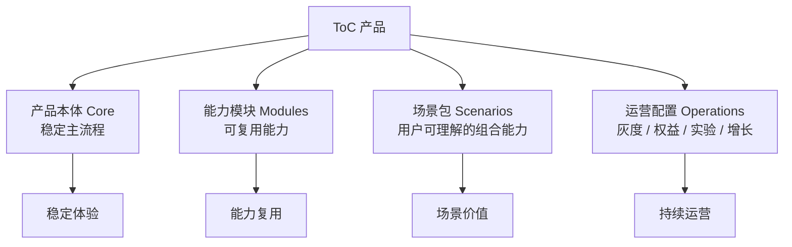

这类设计的重点是：

- **技术上模块化**：能力可复用、可替换、可组合。
- **产品上场景化**：用户看到的是服务包、工具包、助手，而不是插件列表。
- **运营上配置化**：权益、实验、灰度、活动可以灵活组合。
- **体验上简单化**：架构复杂度不能转嫁给用户。

---

## 一、为什么 ToC 产品需要这种设计

ToC 产品发展到一定阶段，通常会遇到几个问题：

| 问题         | 表现                                                 |
| ------------ | ---------------------------------------------------- |
| 功能堆叠     | 新需求不断加进主流程，产品越来越重                   |
| 场景分散     | 用户需求很多，但不是每个能力都适合做成主功能         |
| 商业化复杂   | 会员、权益、增值包、活动难以灵活组合                 |
| 增长实验频繁 | AB 实验、灰度、活动玩法需要快速上线和回收            |
| 能力复用困难 | 一个产品失败后，推荐、内容、互动、风控等能力难以沉淀 |

所以 ToC 产品的 Mod 化 / 插件化，目标不是让用户安装插件，而是解决产品持续演进的问题。

```text
不推荐：
所有新功能都塞进主产品流程

推荐：
核心体验留在本体
变化快、可复用、可组合的能力沉淀为模块
对用户包装成场景包或权益包
```

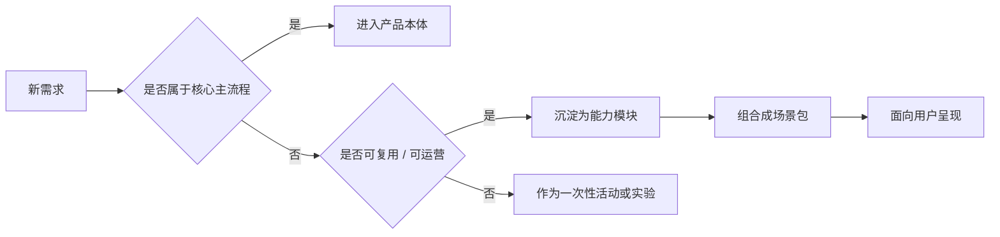

---

## 二、ToC 产品的通用架构

ToC 产品可以拆成四层：

```text
ToC 产品架构

┌──────────────────────────────────────────────┐
│ 场景体验层                                    │
│ 新手包 / 会员包 / 工具包 / 服务包 / 活动包      │
├──────────────────────────────────────────────┤
│ 能力模块层                                    │
│ 内容 / 推荐 / 互动 / 搜索 / 风控 / 商业化       │
├──────────────────────────────────────────────┤
│ 产品本体层                                    │
│ 账号 / 用户数据 / 主流程 / 支付 / 消息 / 数据   │
├──────────────────────────────────────────────┤
│ 基础平台层                                    │
│ 登录 / 存储 / 同步 / 埋点 / 灰度 / 配置 / 安全  │
└──────────────────────────────────────────────┘
```

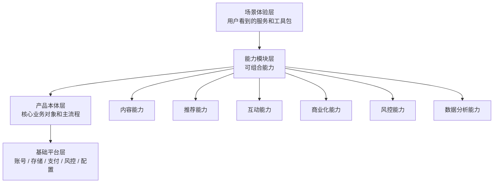

各层职责：

| 层级       | 职责                                   | 关键问题                       |
| ---------- | -------------------------------------- | ------------------------------ |
| 基础平台层 | 提供账号、支付、存储、风控、配置、埋点 | 产品是否具备持续运营能力       |
| 产品本体层 | 承载核心用户路径和领域对象             | 什么必须稳定在主产品里         |
| 能力模块层 | 沉淀可复用、可替换、可组合能力         | 哪些能力可以脱离主流程复用     |
| 场景体验层 | 把多个能力包装成用户能理解的服务       | 用户看到的是不是简单完整的场景 |

---

## 三、模块不是给用户看的，场景包才是

ToC 产品要避免把技术模块直接暴露给用户。

用户不关心：

```text
策略规则模块
内容生成模块
数据解析模块
风控识别模块
权益配置模块
```

用户关心：

```text
帮我完成当前任务
帮我整理重要信息
帮我获得更合适的推荐
帮我更安全地使用产品
帮我更快完成任务
```

因此，对外表达应该从“模块”转成“场景包”。

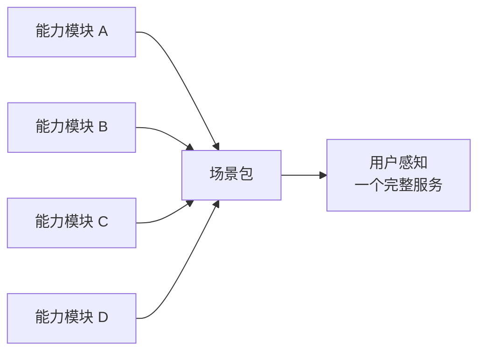

例如：

| 内部能力模块 | 对外场景包 |
| --- | --- |
| 用户画像、引导规则、提示内容 | 新手引导包 / 个性化服务包 |
| 信息分类、内容摘要、待办提取 | 效率助手 / 信息整理包 |
| 内容处理、推荐规则、数据分析 | 内容增强包 / 运营辅助包 |

---

## 四、运营配置化：让能力可以被持续运营

运营配置化解决的是另一个问题：

> 能力模块和场景包不能每次都靠发版调整，而应该能通过配置控制“谁能用、何时用、怎么收费、怎么实验、怎么灰度”。

ToC 产品的很多变化不是底层能力变化，而是运营策略变化。

例如：

- 同一个能力，新用户免费试用，老用户需要会员。
- 同一个场景包，先在 10% 用户中灰度。
- 同一个权益，在不同会员等级中开放不同额度。
- 同一个功能文案，需要做 AB 实验。
- 同一个服务包，在活动期间临时组合售卖。

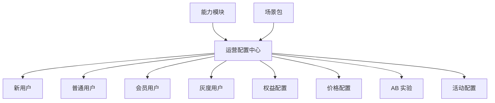

运营配置通常包括：

| 配置项   | 说明                       | 示例                          |
| -------- | -------------------------- | ----------------------------- |
| 人群配置 | 控制哪些用户可见、可用     | 新用户、会员用户、某地区用户  |
| 权益配置 | 控制能力额度和使用限制 | 每日使用次数、会员专属额度 |
| 价格配置 | 控制是否收费、如何打包售卖 | 能力包单买或并入会员 |
| 灰度配置 | 控制功能逐步开放           | 先给 5% 用户，再逐步放量      |
| 实验配置 | 控制 AB 测试 | 不同入口文案、不同结果排序 |
| 活动配置 | 控制短期运营组合           | 节日活动包、新用户体验包      |

因此，配置化不是简单的“开关管理”，而是 ToC 产品持续运营的基础能力。

---

## 五、体验简单化：复杂留给系统，简单留给用户

体验简单化解决的是用户侧的问题：

> 用户不应该理解模块、插槽、配置、策略，只应该看到一个清晰入口、一个明确结果、一条顺畅路径。

内部可以很复杂：

```text
多个能力模块 + 多个人群配置 + 多个权益规则 + 多个实验策略
```

但用户看到的应该很简单：

```text
一键完成设置
整理重要信息
生成可用内容
开启安全保护
查看使用建议
```

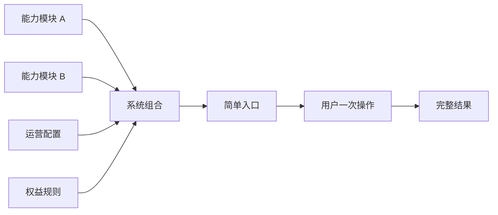

体验简单化可以从几个设计原则入手：

| 原则     | 说明                           | 示例                               |
| -------- | ------------------------------ | ---------------------------------- |
| 入口少 | 不把所有模块都做成独立入口 | 一个入口承载同一场景下的多个能力 |
| 默认好 | 默认参数尽量合理，减少用户配置 | 自动选择推荐规则、自动生成摘要 |
| 场景完整 | 一次服务尽量覆盖完整任务 | 同时完成分类、总结、提醒、建议 |
| 结果可改 | 自动生成结果后允许用户调整 | 草稿、推荐结果、配置建议都可修改 |
| 逐步展开 | 高级配置隐藏在二级路径 | 普通用户一键使用，高级用户再调参数 |

所以，ToC 产品的简单化不是能力少，而是把复杂能力组织成用户能理解的路径。

---

## 六、示例一：婚恋 App

### 6.1 产品本体

婚恋 App 的本体不是所有功能的集合，而是稳定的相亲 / 匹配主流程。

```text
婚恋 App 本体
├─ 账号
├─ 用户资料
├─ 实名 / 身份认证
├─ 推荐 / 匹配
├─ 聊天
├─ 会员 / 支付
└─ 安全 / 风控
```

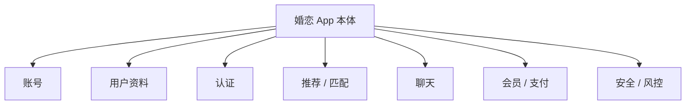

### 6.2 能力模块

婚恋 App 可沉淀的能力模块：

| 能力模块     | 说明                                     |
| ------------ | ---------------------------------------- |
| 资料优化模块 | 头像、简介、标签、择偶条件优化           |
| 匹配策略模块 | 按城市、年龄、职业、兴趣、活跃度调整推荐 |
| 破冰话术模块 | 生成开场白、回复建议、聊天话题           |
| 约会规划模块 | 推荐约会地点、时间、话题                 |
| 安全防骗模块 | 异常账号、诈骗风险、敏感行为识别         |
| 红娘服务模块 | 人工服务、半自动撮合、关系推进           |
| 会员权益模块 | 曝光、置顶、查看权限、专属推荐           |

### 6.3 用户看到的场景包

用户不应该看到“安装资料优化插件”，而应该看到更自然的服务：

| 场景包       | 组合能力                     |
| ------------ | ---------------------------- |
| 资料优化包   | 资料分析、头像建议、简介优化 |
| 高质量匹配包 | 匹配策略、筛选条件、会员权益 |
| 破冰聊天包   | 开场白、话题建议、回复建议   |
| 约会规划包   | 地点推荐、话题建议、日程提醒 |
| 安全防骗包   | 风险识别、异常提醒、举报辅助 |

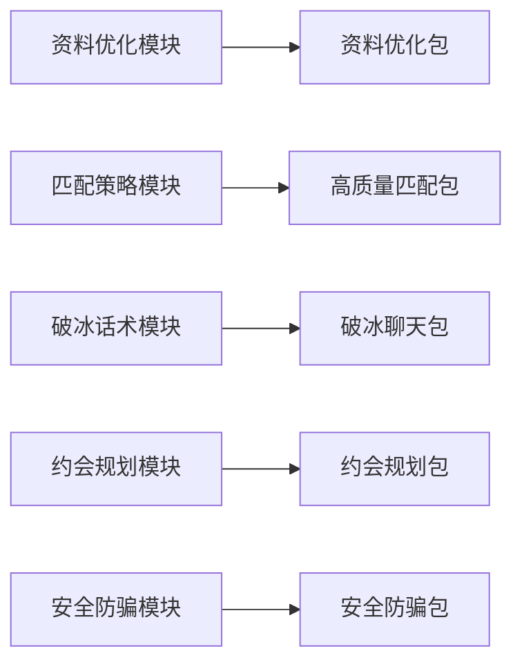

### 6.4 设计价值

婚恋 App 通过这种方式，可以做到：

- 核心匹配体验保持稳定。
- 资料、聊天、约会、安全等能力可以独立迭代。
- 会员权益可以和不同场景包组合售卖。
- 安全风控能力可以复用到其他社交产品。

---

## 七、示例二：2980 邮箱

### 7.1 产品本体

邮箱产品的本体是稳定的邮件处理主流程。

```text
2980 邮箱本体
├─ 账号
├─ 邮件收发
├─ 联系人
├─ 附件
├─ 搜索
├─ 标签 / 文件夹
├─ 通知
└─ 安全 / 反垃圾
```

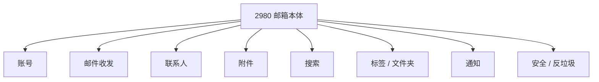

### 7.2 能力模块

2980 邮箱可沉淀的能力模块：

| 能力模块     | 说明                                 |
| ------------ | ------------------------------------ |
| 邮件分类模块 | 自动识别重要邮件、通知邮件、广告邮件 |
| 邮件总结模块 | 总结长邮件、邮件串、多人往来记录     |
| AI 写信模块  | 根据上下文生成回复草稿               |
| 日程识别模块 | 从邮件中提取会议、截止时间、提醒事项 |
| 附件解析模块 | 解析 PDF、Word、Excel、图片          |
| 客户跟进模块 | 识别客户邮件、待跟进事项、超时未回复 |
| 翻译模块     | 跨语言邮件翻译和润色                 |

### 7.3 用户看到的场景包

| 场景包         | 组合能力                 |
| -------------- | ------------------------ |
| 今日邮件助手   | 邮件分类、重点邮件、摘要 |
| 客户跟进助手   | 客户识别、待办提取、提醒 |
| 会议邮件助手   | 日程识别、会议摘要、提醒 |
| 附件处理工具   | 附件解析、摘要、导出     |
| 跨语言邮件服务 | 翻译、润色、回复草稿     |

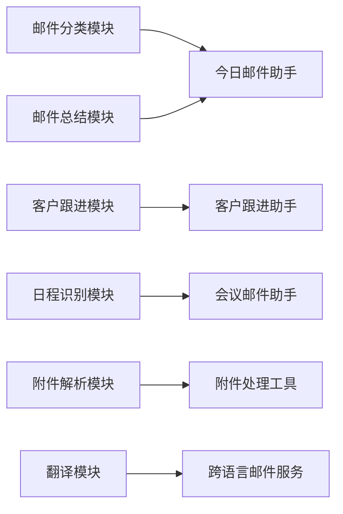

### 7.4 设计价值

2980 邮箱通过这种方式，可以从“收发邮件工具”演进为“个人信息处理中心”：

- 邮件本体保持稳定可靠。
- 邮件总结、附件解析、客户跟进等能力可独立迭代。
- 不同用户群可以配置不同场景包。
- 商务用户、个人用户、跨境用户可以使用不同组合。

---

## 八、示例三：海外社交媒体产品

### 8.1 产品本体

海外社交媒体产品的本体是内容发布、关系互动和分发主流程。

```text
海外社交媒体本体
├─ 账号
├─ 关系链
├─ Feed
├─ 发布
├─ 评论
├─ 私信
├─ 推荐
├─ 数据统计
└─ 风控 / 社区治理
```

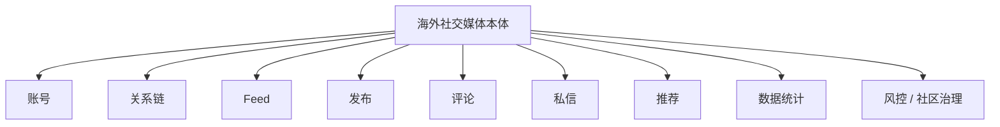

### 8.2 能力模块

海外社交媒体可沉淀的能力模块：

| 能力模块         | 说明                             |
| ---------------- | -------------------------------- |
| 内容创作模块     | 文案、标题、封面、素材生成       |
| 翻译本地化模块   | 多语言翻译、本地表达优化         |
| Hashtag 推荐模块 | 推荐话题、标签、关键词           |
| 发布时间模块     | 根据地区、时区、受众推荐发布时间 |
| 评论管理模块     | 评论总结、回复建议、风险评论识别 |
| 增长分析模块     | 互动、涨粉、转化、内容效果分析   |
| 商业化模块       | 商品挂载、广告、创作者收益       |
| 社区治理模块     | 风险内容识别、举报处理、账号保护 |

### 8.3 用户看到的场景包

| 场景包       | 组合能力                     |
| ------------ | ---------------------------- |
| 创作者工具包 | 文案、封面、话题、发布时间   |
| 跨语言发布包 | 翻译、本地化表达、地区标签   |
| 增长分析包   | 内容数据、粉丝增长、转化分析 |
| 评论管理包   | 评论总结、批量回复、风险提醒 |
| 品牌运营包   | 内容计划、商品挂载、投放分析 |

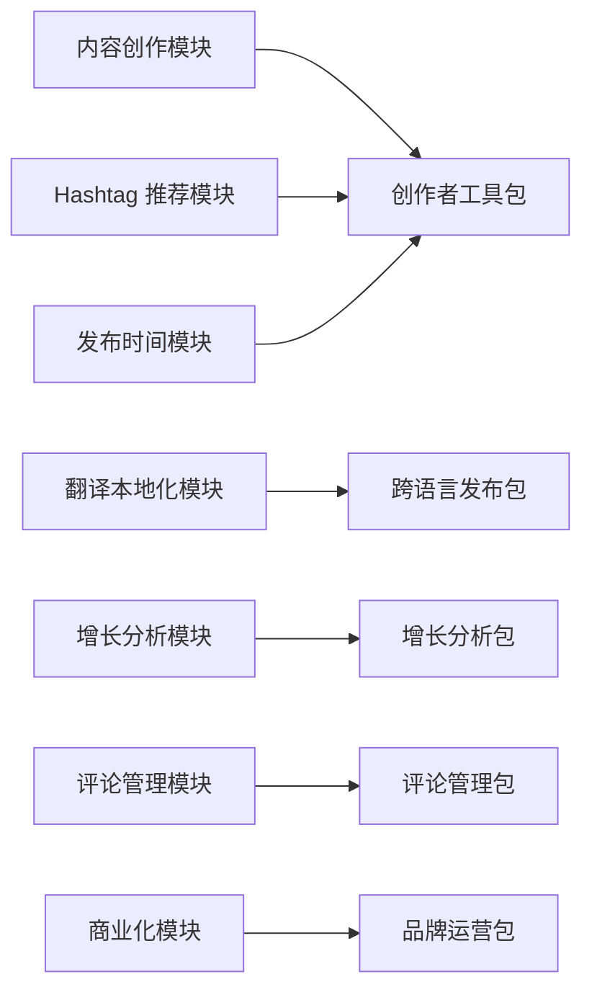

### 8.4 设计价值

海外社交媒体产品通过这种方式，可以做到：

- 核心发布和互动体验保持稳定。
- 创作者、品牌方、普通用户可以看到不同场景包。
- 不同国家和地区可以配置不同本地化能力。
- 增长分析、内容创作、商业化能力可以独立演进。

---

## 九、落地路径

ToC 产品做 Mod 化 / 插件化，不建议一开始开放插件市场。更合理的是分阶段推进。

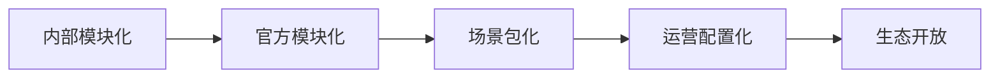

### 9.1 内部模块化

先把产品内部能力拆出来，不对用户暴露插件概念。

- 拆核心主流程和可变能力。
- 抽象领域对象和能力边界。
- 让能力可以独立开发、测试、发布。

### 9.2 官方模块化

先由官方团队开发模块，降低质量和安全风险。

- 官方资料优化模块。
- 官方邮件总结模块。
- 官方创作者工具模块。
- 官方安全风控模块。

### 9.3 场景包化

把模块组合成用户理解的产品表达。

- 婚恋：资料优化包、破冰聊天包。
- 邮箱：今日邮件助手、客户跟进助手。
- 社媒：创作者工具包、增长分析包。

### 9.4 运营配置化

通过配置支持会员权益、灰度发布、AB 实验、活动运营。

- 哪些用户可见。
- 哪些用户可用。
- 哪些能力收费。
- 哪些能力灰度。
- 哪些能力参与实验。

### 9.5 生态开放

只有当用户规模、场景复杂度、审核机制、权限体系成熟后，再考虑开放外部生态。

过早开放插件生态，容易带来：

- 体验割裂。
- 插件质量不可控。
- 隐私和安全风险。
- 性能问题。
- 审核和运营成本上升。

---

## 十、阶段性结论

ToC 产品的 Mod 化 / 插件化，不应该表现为让用户管理插件，而应该表现为产品能力持续变强。

更准确的表达是：

> ToC 产品技术上模块化，架构上领域化，产品上场景化，运营上配置化。产品本体保持稳定，能力模块持续沉淀，场景包面向用户表达，运营配置支持增长和商业化。

三个产品示例可以这样总结：

| 产品      | 本体                                       | 能力模块                                           | 场景包                                   |
| --------- | ------------------------------------------ | -------------------------------------------------- | ---------------------------------------- |
| 婚恋 App  | 资料、认证、匹配、聊天、会员、风控         | 资料优化、匹配策略、破冰话术、约会规划、安全防骗   | 资料优化包、高质量匹配包、破冰聊天包     |
| 2980 邮箱 | 邮件、联系人、附件、搜索、标签、安全       | 邮件分类、邮件总结、日程识别、附件解析、客户跟进   | 今日邮件助手、客户跟进助手、会议邮件助手 |
| 海外社媒  | 账号、关系链、Feed、发布、评论、私信、推荐 | 内容创作、翻译本地化、话题推荐、增长分析、评论管理 | 创作者工具包、跨语言发布包、增长分析包   |

最终，用户不需要理解“插件化”，只需要感受到：

- 产品更轻。
- 场景更完整。
- 能力更丰富。
- 服务更个性化。
- 体验持续变好。
